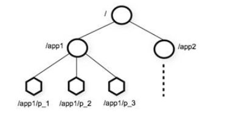

### 1. zookeeper的数据模型

* ZooKeeper 的数据模型，在结构上和标准文件系统的非常相似，拥有一个层

次的命名空间，都是采用[树形层次结构]().

	

* ZooKeeper 树中的每个节点被称为—个Znode。和文件系统的目录树一样，ZooKeeper 树中的每个节点可以拥有子节点。

但也有不同之处：

1. Znode [兼具文件和目录两种特点]()。既像文件一样维护着数据、元信息、ACL、 时间戳等数据结构，又像目录一样可以作为路径标识的一部分，并可以具有 子 Znode。用户对 Znode 具有增、删、改、查等操作（权限允许的情况下）。
2. Znode 存[储数据大小有限制]()。ZooKeeper 虽然可以关联一些数据，但并没有 被设计为常规的数据库或者大数据存储，相反的是，它用来管理调度数据， 比如分布式应用中的配置文件信息、状态信息、汇集位置等等。这些数据的 共同特性就是它们都是很小的数据，通常以 KB 为大小单位。ZooKeeper 的服 务器和客户端都被设计为严格检查并限制每个 Znode 的数据大小至多 1M，常规使用中应该远小于此值。
3. Znode [通过路径引用]()，如同 Unix 中的文件路径。**路径必须是绝对的**，因此他 们必须由斜杠字符来开头。除此以外，他们必须是唯一的，也就是说每一个 路径只有一个表示，因此这些路径不能改变。在 ZooKeeper 中，路径由 Unicode 字符串组成，并且有一些限制。字符串"/zookeeper"用以保存管理 信息，比如关键配额信息。
4. 每个 Znode 由 3 部分组成:
   * [stat：]()此为状态信息, 描述该 Znode 的版本, 权限等信息
   * [data：]()与该 Znode 关联的数据
   * [children]()：该 Znode 下的子节点

###2.  Znode节点类型

 2.1 Znode 有两种，分别为**临时节点**和**永久节点**。节点的类型在创建时即被确定，并且不能改变。

* [临时节点]()：该节点的生命周期依赖于创建它们的会话。一旦会话结束，临时 节点将被自动删除，当然可以也可以手动删除。临时节点不允许拥有子节点。
* [永久节点]()：该节点的生命周期不依赖于会话，并且只有在客户端显示执行删除操作的时候，他们才能被删除。

2.2 Znode 还有一个序列化的特性，如果创建的时候指定的话，该 Znode 的名字后面会自动追加一个不断增加的序列号。序列号对于此节点的父节点来说是唯一的，这样便会记录每个子节点创建的先后顺序。它的格式为“%10d”(10 位数字，没有数值的数位用 0 补充，例如“0000000001”)。

2.3 这样便会存在四种类型的 Znode 节点，分别对应：

  *  PERSISTENT：永久节点
  *  EPHEMERAL：临时节点
  *  PERSISTENT_SEQUENTIAL：永久节点、序列化
  *  EPHEMERAL_SEQUENTIAL：临时节点、序列化

 

### 3.Zookeeper的Shell 客户端操作

####3.1 登录Zookeeper客户端

~~~she
bin/zkCli.sh  -server node01:2181
~~~

####3.2 Zookeeper客户端操作命令

| 命令                             | 说明                                          | 参数                                             |
| -------------------------------- | --------------------------------------------- | ------------------------------------------------ |
| `create [-s] [-e] path data acl` | 创建Znode                                     | -s 指定是顺序节点 -e 指定是临时节点           |
| `ls path [watch]`                | 列出Path下所有子Znode                         |                                                  |
| `get path [watch]`               | 获取Path对应的Znode的数据和属性               |                                                  |
| `ls2 path [watch]`               | 查看Path下所有子Znode以及子Znode的属性        |                                                  |
| `set path data [version]`        | 更新节点                                      | version 数据版本                                 |
| `delete path [version]`          | 删除节点, 如果要删除的节点有子Znode则无法删除 | version 数据版本                                 |
| `rmr path`                       | 删除节点, 如果有子Znode则递归删除             |                                                  |
| `setquota -n|-b val path`        | 修改Znode配额                                 | -n 设置子节点最大个数 -b 设置节点数据最大长度 |
| `history`                        | 列出历史记录                                  |                                                  |

#### 3.3 操作实例

 [列出Path下的所有Znode]()

   `ls  /`

 [创建永久节点]()

   `create /hello world`

[创建临时节点：]()

​     `create -e /abc 123`

[创建永久序列化节点：]()

   `create -s /zhangsan boy`

[创建临时序列化节点：]()

   `create -e -s /lisi boy`

 [修改节点数据]()

  `set /hello zookeeper`

 [删除节点, 如果要删除的节点有子Znode则无法删除]()

   `delete /hello`

 [删除节点, 如果有子Znode则递归删除]()

  `rmr /abc`

[列出历史记录]()

  `histroy`

#### 3.4 节点属性

每个 znode 都包含了一系列的属性，通过命令 get，可以获得节点的属性。

 

[dataVersion]()：数据版本号，每次对节点进行 set 操作，dataVersion 的值都会增加 1（即使设置的是相同的数据），可有效避免了数据更新时出现的先后顺序问题。

[cversion]() ：子节点的版本号。当 znode 的子节点有变化时，cversion 的值就会增加 1。

 [aclVersion]() ：ACL 的版本号。

 [cZxid]() ：Znode 创建的事务 id。

[mZxid]()	：Znode 被修改的事务 id，即每次对 znode 的修改都会更新 mZxid。

* 对于 zk 来说，每次的变化都会产生一个唯一的事务 id，zxid（ZooKeeper Transaction Id）。通过 zxid，可以确定更新操作的先后顺序。例如，如果 zxid1
* 小于 zxid2，说明 zxid1 操作先于 zxid2 发生，zxid 对于整个 zk 都是唯一的，

[ctime]()：节点创建时的时间戳.

[mtime]()：节点最新一次更新发生时的时间戳.

[ephemeralOwner]():如果该节点为临时节点, ephemeralOwner 值表示与该节点绑定的 session id. 如果不  是,ephemeralOwner 值为 0.

####3.5 Zookeeper的watch机制

- 通知类似于数据库中的触发器, 对某个Znode设置 `Watcher`, 当Znode发生变化的时候, `WatchManager`会调用对应的`Watcher`
- 当Znode发生删除, 修改, 创建, 子节点修改的时候, 对应的`Watcher`会得到通知
- `Watcher`的特点
  - **一次性触发** 一个 `Watcher` 只会被触发一次, 如果需要继续监听, 则需要再次添加 `Watcher`
  - 事件封装: `Watcher` 得到的事件是被封装过的, 包括三个内容 `keeperState, eventType, path`

| KeeperState   | EventType        | 触发条件                 | 说明                               |
| ------------- | ---------------- | ------------------------ | ---------------------------------- |
|               | None             | 连接成功                 |                                    |
| SyncConnected | NodeCreated      | Znode被创建              | 此时处于连接状态                   |
| SyncConnected | NodeDeleted      | Znode被删除              | 此时处于连接状态                   |
| SyncConnected | NodeDataChanged  | Znode数据被改变          | 此时处于连接状态                   |
| SyncConnected | NodeChildChanged | Znode的子Znode数据被改变 | 此时处于连接状态                   |
| Disconnected  | None             | 客户端和服务端断开连接   | 此时客户端和服务器处于断开连接状态 |
| Expired       | None             | 会话超时                 | 会收到一个SessionExpiredExceptio   |
| AuthFailed    | None             | 权限验证失败             | 会收到一个AuthFailedException      |

### 4: zookeeper的JavaAPI操作

 	这里操作Zookeeper的JavaAPI使用的是一套zookeeper客户端框架 Curator ，解决了很多Zookeeper客户端非常底层的细节开发工作 。

Curator包含了几个包：

*  [curator-framework]()：对zookeeper的底层api的一些封装
*  [curator-recipes]()：封装了一些高级特性，如：Cache事件监听、选举、分布式锁、分布式计数器等

 Maven依赖(使用curator的版本：2.12.0，对应Zookeeper的版本为：3.4.x，如果跨版本会有兼容性问题，很有可能导致节点操作失败)：

#### 4.1、创建java工程，导入jar包

创建maven  java工程，导入jar包

~~~xml
  <!-- <repositories>

        <repository>

          <id>cloudera</id>

          <url>https://repository.cloudera.com/artifactory/cloudera-repos/</url>

        </repository>

      </repositories> -->

    <dependencies>

        <dependency>

            <groupId>org.apache.curator</groupId>

            <artifactId>curator-framework</artifactId>

            <version>2.12.0</version>

        </dependency>

        <dependency>

            <groupId>org.apache.curator</groupId>

            <artifactId>curator-recipes</artifactId>

            <version>2.12.0</version>

        </dependency>

        <dependency>

            <groupId>com.google.collections</groupId>

            <artifactId>google-collections</artifactId>

            <version>1.0</version>
        </dependency>
        <dependency>
            <groupId>junit</groupId>
            <artifactId>junit</artifactId>
            <version>RELEASE</version>
        </dependency>
        <dependency>
            <groupId>org.slf4j</groupId>
            <artifactId>slf4j-simple</artifactId>
            <version>1.7.25</version>
        </dependency>
    </dependencies>

    <build>

        <plugins>

            <!-- java编译插件 -->

            <plugin>

                <groupId>org.apache.maven.plugins</groupId>

                <artifactId>maven-compiler-plugin</artifactId>

                <version>3.2</version>

                <configuration>

                    <source>1.8</source>

                    <target>1.8</target>

                    <encoding>UTF-8</encoding>

                </configuration>

            </plugin>

        </plugins>

    </build>
~~~

####4.2 节点的操作

#####  `创建永久节点`

~~~java
@Test
public void createNode() throws Exception {

   RetryPolicy retryPolicy = new  ExponentialBackoffRetry(1000, 1);
   //获取客户端对象
   CuratorFramework client =     CuratorFrameworkFactory.newClient("192.168.174.100:2181,192.168.174.110:2181,192.168.174.120:2181", 1000, 1000, retryPolicy);
    
  //调用start开启客户端操作
  client.start();
    
  //通过create来进行创建节点，并且需要指定节点类型
  client.create().creatingParentsIfNeeded().withMode(CreateMode.PERSISTENT).forPath("/hello3/world");

 client.close();
}
~~~

##### `创建临时节点`

~~~java
public void createNode2() throws Exception {

	RetryPolicy retryPolicy = new  ExponentialBackoffRetry(3000, 1);

  CuratorFramework client = CuratorFrameworkFactory.newClient("node01:2181,node02:2181,node03:2181", 3000, 3000, retryPolicy);

client.start();

client.create().creatingParentsIfNeeded().withMode(CreateMode.EPHEMERAL).forPath("/hello5/world");

Thread.sleep(5000);

client.close();
}

~~~

#####`修改节点数据`

~~~java
/**

	 * 节点下面添加数据与修改是类似的，一个节点下面会有一个数据，新的数据会覆盖旧的数据

	 * @throws Exception

	 */

	@Test
	public void nodeData() throws Exception {

		RetryPolicy retryPolicy = new  ExponentialBackoffRetry(3000, 1);

		CuratorFramework client = CuratorFrameworkFactory.newClient("node01:2181,node02:2181,node03:2181", 3000, 3000, retryPolicy);

		client.start();

		client.setData().forPath("/hello5", "hello7".getBytes());

		client.close();
}

~~~

##### `节点数据查询`

~~~java

	/**

	 * 数据查询

	 */

	@Test

	public void updateNode() throws Exception {

		RetryPolicy retryPolicy = new  ExponentialBackoffRetry(3000, 1);

		CuratorFramework client = CuratorFrameworkFactory.newClient("node01:2181,node02:2181,node03:2181", 3000, 3000, retryPolicy);

		client.start();

		byte[] forPath = client.getData().forPath("/hello5");

		System.out.println(new String(forPath));

		client.close();

	}

~~~

##### `节点watch机制`

~~~java
	/**

	 * zookeeper的watch机制

	 * @throws Exception

	 */
	@Test
	public void watchNode() throws Exception {

		RetryPolicy policy = new ExponentialBackoffRetry(3000, 3);

		CuratorFramework client = CuratorFrameworkFactory.newClient("node01:2181,node02:2181,node03:2181", policy);

		client.start();

		// ExecutorService pool = Executors.newCachedThreadPool();  

	        //设置节点的cache  

	        TreeCache treeCache = new TreeCache(client, "/hello5");  

	        //设置监听器和处理过程  

	        treeCache.getListenable().addListener(new TreeCacheListener() {  

	            @Override  

	            public void childEvent(CuratorFramework client, TreeCacheEvent event) throws Exception {  

	                ChildData data = event.getData();  

	                if(data !=null){  

	                    switch (event.getType()) { 

	                    case NODE_ADDED:  

	                        System.out.println("NODE_ADDED : "+ data.getPath() +"  数据:"+ new String(data.getData()));  

	                        break;  

	                    case NODE_REMOVED:  

	                        System.out.println("NODE_REMOVED : "+ data.getPath() +"  数据:"+ new String(data.getData()));  

	                        break;  

	                    case NODE_UPDATED:  

	                        System.out.println("NODE_UPDATED : "+ data.getPath() +"  数据:"+ new String(data.getData()));  

	                        break;  

	                          

	                    default:  

	                        break;  

	                    }  

	                }else{  

	                    System.out.println( "data is null : "+ event.getType());  

	                }  

	            }  

	        });  

	        //开始监听  

	        treeCache.start();  

	        Thread.sleep(50000000);

	}
~~~
