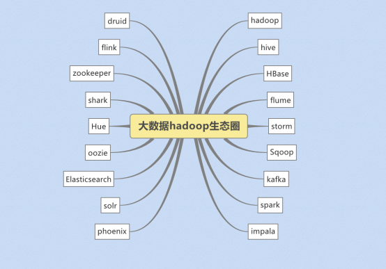

##Hadoop

###1、 Hadoop的介绍

1. Hadoop最早起源于Nutch。Nutch的设计目标是构建一个大型的全网搜索引擎，包括网页抓取、索引、查询等功能，但随着抓取网页数量的增加，遇到了严重的可扩展性问题——如何解决数十亿网页的存储和索引问题。
2. 2003年、2004年谷歌发表的两篇论文为该问题提供了可行的解决方案。

——分布式文件系统（GFS），可用于处理海量网页的存储

——分布式计算框架MAPREDUCE，可用于处理海量网页的索引计算问题。

3. Nutch的开发人员完成了相应的开源实现HDFS和MAPREDUCE，并从Nutch中剥离成为独立项目HADOOP，到2008年1月，HADOOP成为Apache顶级项目.

狭义上来说，hadoop就是单独指代hadoop这个软件，

* HDFS    ：分布式文件系统
* MapReduce : 分布式计算系统
*   Yarn：分布式样集群资源管理 

广义上来说，hadoop指代大数据的一个生态圈，包括很多其他的软件

 

  

###2、hadoop的历史版本和发行版公司

 ##### 2.1 Hadoop历史版本

1.x版本系列：hadoop版本当中的第二代开源版本，主要修复0.x版本的一些bug等

2.x版本系列：架构产生重大变化，引入了yarn平台等许多新特性

3.x版本系列:  加入多namenoode新特性

##### 2.2 Hadoop三大发行版公司

* 免费开源版本apache:

<http://hadoop.apache.org/>

优点：拥有全世界的开源贡献者，代码更新迭代版本比较快，

缺点：版本的升级，版本的维护，版本的兼容性，版本的补丁都可能考虑不太周到，

apache所有软件的下载地址（包括各种历史版本）：

<http://archive.apache.org/dist/>

* 免费开源版本hortonWorks：

<https://hortonworks.com/>

hortonworks主要是雅虎主导Hadoop开发的副总裁，带领二十几个核心成员成立Hortonworks，核心产品软件HDP（ambari），HDF免费开源，并且提供一整套的web管理界面，供我们可以通过web界面管理我们的集群状态，web管理界面软件HDF网址（<http://ambari.apache.org/>）

 

* 软件收费版本ClouderaManager:

<https://www.cloudera.com/>

cloudera主要是美国一家大数据公司在apache开源hadoop的版本上，通过自己公司内部的各种补丁，实现版本之间的稳定运行，大数据生态圈的各个版本的软件都提供了对应的版本，解决了版本的升级困难，版本兼容性等各种问题

 


###3、hadoop的架构模型

#### 1.x的版本架构模型介绍

	

文件系统核心模块：

NameNode：集群当中的主节点，管理元数据(文件的大小，文件的位置，文件的权限)，主要用于管理集群当中的各种数据

secondaryNameNode：主要能用于hadoop当中元数据信息的辅助管理

DataNode：集群当中的从节点，主要用于存储集群当中的各种数据

数据计算核心模块：

JobTracker：接收用户的计算请求任务，并分配任务给从节点

TaskTracker：负责执行主节点JobTracker分配的任务

####2.x的版本架构模型介绍

 第一种：NameNode与ResourceManager单节点架构模型

	

文件系统核心模块：

NameNode：集群当中的主节点，主要用于管理集群当中的各种数据

secondaryNameNode：主要能用于hadoop当中元数据信息的辅助管理

DataNode：集群当中的从节点，主要用于存储集群当中的各种数据

数据计算核心模块：

ResourceManager：接收用户的计算请求任务，并负责集群的资源分配

NodeManager：负责执行主节点APPmaster分配的任务

第二种：NameNode单节点与ResourceManager高可用架构模型

	

文件系统核心模块：

NameNode：集群当中的主节点，主要用于管理集群当中的各种数据

secondaryNameNode：主要能用于hadoop当中元数据信息的辅助管理

DataNode：集群当中的从节点，主要用于存储集群当中的各种数据

数据计算核心模块：

ResourceManager：接收用户的计算请求任务，并负责集群的资源分配，以及计算任务的划分，通过zookeeper实现ResourceManager的高可用

NodeManager：负责执行主节点ResourceManager分配的任务

第三种：NameNode高可用与ResourceManager单节点架构模型

	

文件系统核心模块：

NameNode：集群当中的主节点，主要用于管理集群当中的各种数据，其中nameNode可以有两个，形成高可用状态

DataNode：集群当中的从节点，主要用于存储集群当中的各种数据

JournalNode：文件系统元数据信息管理

数据计算核心模块：

ResourceManager：接收用户的计算请求任务，并负责集群的资源分配，以及计算任务的划分

NodeManager：负责执行主节点ResourceManager分配的任务

 

第四种：NameNode与ResourceManager高可用架构模型

	

文件系统核心模块：

NameNode：集群当中的主节点，主要用于管理集群当中的各种数据，一般都是使用两个，实现HA高可用

JournalNode：元数据信息管理进程，一般都是奇数个

DataNode：从节点，用于数据的存储

数据计算核心模块：

ResourceManager：Yarn平台的主节点，主要用于接收各种任务，通过两个，构建成高可用

NodeManager：Yarn平台的从节点，主要用于处理ResourceManager分配的任务


###4、appache版本hadoop重新编译

####4.1为什么要编译hadoop

由于appache给出的hadoop的安装包没有提供带C程序访问的接口，所以我们在使用本地库（本地库可以用来做压缩，以及支持C程序等等）的时候就会出问题,需要对Hadoop源码包进行重新编译.

####4.2编译环境的准备

#####4.2.1：准备linux环境

准备一台linux环境，内存4G或以上，硬盘40G或以上，我这里使用的是Centos6.9  64位的操作系统（注意：一定要使用64位的操作系统）

#####4.2.2：虚拟机联网，关闭防火墙，关闭selinux

关闭防火墙命令：

```shell
service  iptables   stop
chkconfig   iptables  off 
```

关闭selinux

`vim /etc/selinux/config`

 

#####4.2.3：安装jdk1.7

注意hadoop-2.7.5 这个版本的编译，只能使用jdk1.7，如果使用jdk1.8那么就会报错

查看centos6.9自带的openjdk

`rpm -qa | grep java` 

 

 

将所有这些openjdk全部卸载掉

`rpm -e java-1.6.0-openjdk-1.6.0.41-1.13.13.1.el6_8.x86_64 tzdata-java-2016j-1.el6.noarch java-1.7.0-openjdk-1.7.0.131-2.6.9.0.el6_8.x86_64`

注意：这里一定不要使用jdk1.8，亲测jdk1.8会出现错误

将我们jdk的安装包上传到/export/softwares（我这里使用的是jdk1.7.0_71这个版本）

解压我们的jdk压缩包

统一两个路径

```shell
mkdir -p /export/servers
mkdir -p /export/softwares
cd /export/softwares
tar -zxvf jdk-7u71-linux-x64.tar.gz -C ../servers/
```


配置环境变量

`vim /etc/profile`

```shell
export JAVA_HOME=/export/servers/jdk1.7.0_71
export PATH=:$JAVA_HOME/bin:$PATH
```

 

让修改立即生效

`source /etc/profile`

#####4.2.4：安装maven

这里使用maven3.x以上的版本应该都可以，不建议使用太高的版本，强烈建议使用3.0.5的版本即可

将maven的安装包上传到/export/softwares

然后解压maven的安装包到/export/servers

```shell
cd /export/softwares/
tar -zxvf apache-maven-3.0.5-bin.tar.gz -C ../servers/
```

配置maven的环境变量

`vim /etc/profile`

```shell
export MAVEN_HOME=/export/servers/apache-maven-3.0.5
export MAVEN_OPTS="-Xms4096m -Xmx4096m"
export PATH=:$MAVEN_HOME/bin:$PATH
```

 

让修改立即生效

`source /etc/profile`

解压maven的仓库

`tar -zxvf mvnrepository.tar.gz  -C /export/servers/`

修改maven的配置文件

```shell
cd  /export/servers/apache-maven-3.0.5/conf
vim settings.xml
```

指定我们本地仓库存放的路径

 

添加一个我们阿里云的镜像地址，会让我们下载jar包更快

```xml
 <mirror>
      <id>alimaven</id>
      <name>aliyun maven</name>
      <url>http://maven.aliyun.com/nexus/content/groups/public/</url>
      <mirrorOf>central</mirrorOf>
    </mirror>
```

 

#####4.2.5：安装findbugs

解压findbugs

`tar -zxvf findbugs-1.3.9.tar.gz -C ../servers/`

配置findbugs的环境变量

`vim /etc/profile`

```shell
export JAVA_HOME=/export/servers/jdk1.7.0_75
export PATH=:$JAVA_HOME/bin:$PATH

export MAVEN_HOME=/export/servers/apache-maven-3.0.5
export PATH=:$MAVEN_HOME/bin:$PATH

export FINDBUGS_HOME=/export/servers/findbugs-1.3.9
export PATH=:$FINDBUGS_HOME/bin:$PATH
```

 

让修改立即生效

 `source  /etc/profile`

#####4.2.6：在线安装一些依赖包

```shell
yum install autoconf automake libtool cmake
yum install ncurses-devel
yum install openssl-devel
yum install lzo-devel zlib-devel gcc gcc-c++
```

bzip2压缩需要的依赖包

```shell
yum install -y  bzip2-devel
```

#####4.2.7：安装protobuf

解压protobuf并进行编译

```shell
cd  /export/softwares
tar -zxvf protobuf-2.5.0.tar.gz -C ../servers/
cd   /export/servers/protobuf-2.5.0
./configure
make && make install
```

#####4.2.8、安装snappy

```shell
cd /export/softwares/
tar -zxf snappy-1.1.1.tar.gz  -C ../servers/
cd ../servers/snappy-1.1.1/
./configure
make && make install
```

#####4.2.9：编译hadoop源码

对源码进行编译

```shell
cd  /export/softwares
tar -zxvf hadoop-2.7.5-src.tar.gz  -C ../servers/
cd  /export/servers/hadoop-2.7.5
```

编译支持snappy压缩：

`mvn package -DskipTests -Pdist,native -Dtar -Drequire.snappy -e -X`

编译完成之后我们需要的压缩包就在下面这个路径里面

```shell
/export/servers/hadoop-2.7.5/hadoop-dist/target
```


###5、Hadoop安装

集群规划

| 服务器IP          | 192.168.174.100 | 192.168.174.110 | 192.168.174.120 |
| ----------------- | --------------- | --------------- | --------------- |
| 主机名            | node01          | node02          | node03          |
| NameNode          | 是              | 否              | 否              |
| SecondaryNameNode | 是              | 否              | 否              |
| dataNode          | 是              | 是              | 是              |
| ResourceManager   | 是              | 否              | 否              |
| NodeManager       | 是              | 是              | 是              |

 

#### 第一步：上传apache hadoop包并解压

解压命令

```shell
cd /export/softwares
tar -zxvf hadoop-2.7.5.tar.gz -C ../servers/
```

 

#### 第二步：修改配置文件

##### [修改core-site.xml]()

第一台机器执行以下命令

```shell
cd  /export/servers/hadoop-2.7.5/etc/hadoop
vim  core-site.xml
```

```xml
<configuration>

	<property>
		<name>fs.default.name</name>
		<value>hdfs://node01:8020</value>
	</property>
    
	<property>
		<name>hadoop.tmp.dir</name>
		<value>/export/servers/hadoop-2.7.5/hadoopDatas/tempDatas</value>

	</property>

	<!--  缓冲区大小，实际工作中根据服务器性能动态调整 -->

	<property>
		<name>io.file.buffer.size</name>
		<value>4096</value>
	</property>

	<!--  开启hdfs的垃圾桶机制，删除掉的数据可以从垃圾桶中回收，单位分钟 -->
	<property>
		<name>fs.trash.interval</name>
		<value>10080</value>
	</property>
</configuration>
```


##### [修改hdfs-site.xml]()

第一台机器执行以下命令

```shell
cd  /export/servers/hadoop-2.7.5/etc/hadoop
vim hdfs-site.xml
```

```xml
<configuration>
	 <property>
			<name>dfs.namenode.secondary.http-address</name>
			<value>node01:50090</value>
	</property>

	<property>
		<name>dfs.namenode.http-address</name>
		<value>node01:50070</value>
	</property>
	<property>
		<name>dfs.namenode.name.dir</name>
		<value>file:///export/servers/hadoop-2.7.5/hadoopDatas/namenodeDatas,file:///export/servers/hadoop-2.7.5/hadoopDatas/namenodeDatas2</value>
	</property>
	<!--  定义dataNode数据存储的节点位置，实际工作中，一般先确定磁盘的挂载目录，然后多个目录用，进行分割  -->

	<property>
		<name>dfs.datanode.data.dir</name>
		<value>file:///export/servers/hadoop-2.7.5/hadoopDatas/datanodeDatas,file:///export/servers/hadoop-2.7.5/hadoopDatas/datanodeDatas2</value>
	</property>	
    
	<property>
		<name>dfs.namenode.edits.dir</name>
		<value>file:///export/servers/hadoop-2.7.5/hadoopDatas/nn/edits</value>
	</property>

	<property>
		<name>dfs.namenode.checkpoint.dir</name>
		<value>file:///export/servers/hadoop-2.7.5/hadoopDatas/snn/name</value>
	</property>
    
	<property>
		<name>dfs.namenode.checkpoint.edits.dir</name>
		<value>file:///export/servers/hadoop-2.7.5/hadoopDatas/dfs/snn/edits</value>
	</property>

	<property>
		<name>dfs.replication</name>
		<value>3</value>
	</property>


	<property>
		<name>dfs.permissions</name>
		<value>false</value>
	</property>

    <property>
		<name>dfs.blocksize</name>
		<value>134217728</value>
	</property>

</configuration>
```


##### [修改hadoop-env.sh]()

第一台机器执行以下命令

```shell
cd  /export/servers/hadoop-2.7.5/etc/hadoop
vim  hadoop-env.sh
```

```shell
export JAVA_HOME=/export/servers/jdk1.8.0_141
```

##### [修改mapred-site.xml]()

第一台机器执行以下命令

```shell
cd  /export/servers/hadoop-2.7.5/etc/hadoop
vim  mapred-site.xml
```

```xml
<configuration>
    
	<property>
		<name>mapreduce.job.ubertask.enable</name>
		<value>true</value>
	</property>


	<property>
		<name>mapreduce.jobhistory.address</name>
		<value>node01:10020</value>
	</property>
 
	<property>
		<name>mapreduce.jobhistory.webapp.address</name>
		<value>node01:19888</value>
	</property>

</configuration>

```

##### 修改yarn-site.xml

第一台机器执行以下命令

```shell
cd  /export/servers/hadoop-2.7.5/etc/hadoop
vim  yarn-site.xml
```

```xml
<configuration>
	<property>
		<name>yarn.resourcemanager.hostname</name>
		<value>node01</value>
	</property>
	<property>
		<name>yarn.nodemanager.aux-services</name>
		<value>mapreduce_shuffle</value>
	</property>
	
	<property>
		<name>yarn.log-aggregation-enable</name>
		<value>true</value>
	</property>
	<property>
		<name>yarn.log-aggregation.retain-seconds</name>
		<value>604800</value>
	</property>
	<property>    
		<name>yarn.nodemanager.resource.memory-mb</name>    
		<value>20480</value>
	</property>
	<property>  
        	 <name>yarn.scheduler.minimum-allocation-mb</name>
         	<value>2048</value>
	</property>
	<property>
		<name>yarn.nodemanager.vmem-pmem-ratio</name>
		<value>2.1</value>
	</property>

</configuration>
```

 

##### 修改mapred-env.sh

第一台机器执行以下命令

```shell
cd  /export/servers/hadoop-2.7.5/etc/hadoop
vim  mapred-env.sh
```

```shell
export JAVA_HOME=/export/servers/jdk1.8.0_141
```

##### 修改slaves

修改slaves文件，然后将安装包发送到其他机器，重新启动集群即可

第一台机器执行以下命令

```shell
cd  /export/servers/hadoop-2.7.5/etc/hadoop
vim slaves
```

```shell
node01
node02
node03
```

第一台机器执行以下命令

```shell
mkdir -p /export/servers/hadoop-2.7.5/hadoopDatas/tempDatas
mkdir -p /export/servers/hadoop-2.7.5/hadoopDatas/namenodeDatas
mkdir -p /export/servers/hadoop-2.7.5/hadoopDatas/namenodeDatas2
mkdir -p /export/servers/hadoop-2.7.5/hadoopDatas/datanodeDatas
mkdir -p /export/servers/hadoop-2.7.5/hadoopDatas/datanodeDatas2
mkdir -p /export/servers/hadoop-2.7.5/hadoopDatas/nn/edits
mkdir -p /export/servers/hadoop-2.7.5/hadoopDatas/snn/name
mkdir -p /export/servers/hadoop-2.7.5/hadoopDatas/dfs/snn/edits
```

安装包的分发

第一台机器执行以下命令

```shell
cd  /export/servers/
scp -r hadoop-2.7.5 node02:$PWD
scp -r hadoop-2.7.5 node03:$PWD
```

#### 第三步：配置hadoop的环境变量

三台机器都要进行配置hadoop的环境变量

三台机器执行以下命令

```shell
vim  /etc/profile
```

```shell
export HADOOP_HOME=/export/servers/hadoop-2.7.5
export PATH=:$HADOOP_HOME/bin:$HADOOP_HOME/sbin:$PATH
```

配置完成之后生效

```shell
source /etc/profile
```

#### 第四步：启动集群

要启动 Hadoop 集群，需要启动 HDFS 和 YARN 两个模块。
注意： 首次启动 HDFS 时，必须对其进行格式化操作。 本质上是一些清理和
准备工作，因为此时的 HDFS 在物理上还是不存在的。

hdfs namenode -format 或者 hadoop namenode –format

准备启动

第一台机器执行以下命令

```shell
cd  /export/servers/hadoop-2.7.5/
bin/hdfs namenode -format
sbin/start-dfs.sh
sbin/start-yarn.sh
sbin/mr-jobhistory-daemon.sh start historyserver
```

三个端口查看界面

[http://node01:50070/explorer.html#/](#/)  查看hdfs

<http://node01:8088/cluster>   查看yarn集群

<http://node01:19888/jobhistory>  查看历史完成的任务