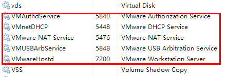
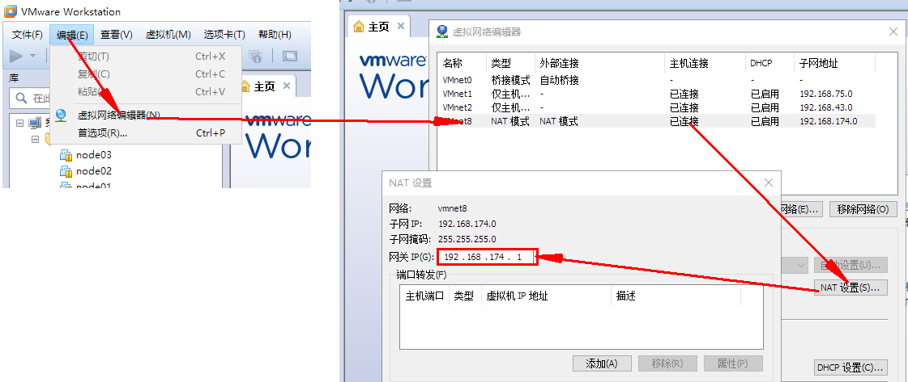
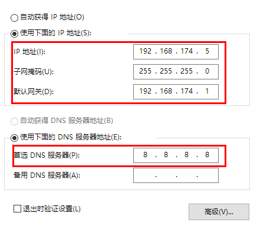
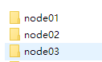
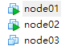
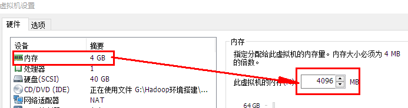
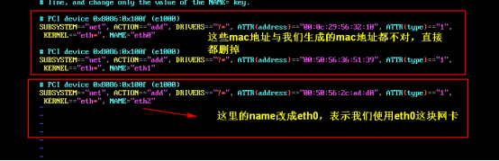
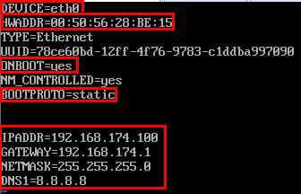
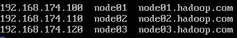
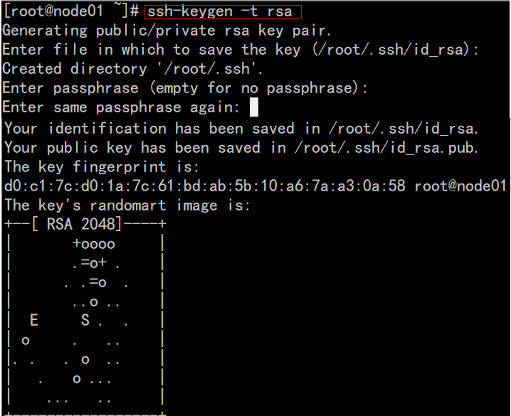

## 集群Linux环境搭建

### 1:注意事项 

    #### 1.1 windows系统确认所有的关于VmWare的服务都已经启动

	

####1.2 **确认好VmWare生成的网关地址**



####1.3 确认VmNet8网卡已经配置好了IP地址和DNS

	

### 2:复制虚拟机

       #### 2.1 将虚拟机文件夹复制三份，并分别重命名,  并使用VM打开重命名

 

----

 

#### 2.2分别设置三台虚拟机的内存

* 需要三台虚拟机, 并且需要同时运行, 所以总体上的占用为: $每台虚拟机内存 \times 3$
* 在分配的时候, 需要在总内存大小的基础上, 减去2G-4G作为系统内存, 剩余的除以3, 作为每台虚拟机的内存

$每台机器的内存 = \left ( 总内存 - 4\right ) \div 3$

	

###3:虚拟机修改Mac和IP

 #### 3.1 集群规划

| IP              | 主机名 | 环境配置                              | 安装                                      |
| --------------- | ------ | ------------------------------------- | ----------------------------------------- |
| 192.168.174.100 | node01 | 关防火墙和selinux, host映射, 时钟同步 | JDK, NameNode, ResourceManager, Zookeeper |
| 192.168.174.120 | node02 | 关防火墙和selinux, host映射, 时钟同步 | JDK, DataNode, NodeManager, Zeekeeper     |
| 192.168.174.130 | node03 | 关防火墙和selinux, host映射, 时钟同步 | JDK, DataNode, NodeManager, Zeekeeper     |

####  3.2 :设置ip和Mac地址

[每台虚拟机更改mac地址：]()

  `vim /etc/udev/rules.d/70-persistent-net.rules`

	

[每台虚拟机更改IP地址:]()

 `vim /etc/sysconfig/network-scripts/ifcfg-eth0`

	

[每台虚拟机修改对应主机名(重启后永久生效)]()

`vi /ect/sysconfig/network`

HOSTNAME=node01

[每台虚拟机]()[设置ip和域名映射]()

`vim /etc/hosts`

	

#### 3.3 inux系统重启

关机重启linux系统即可进行联网了

第二台第三台机器重复上述步骤，并设置IP网址为192.168.174.110，192.168.174.120

### 4:虚拟机关闭防火墙和SELinux

#### 4.1 关闭防火墙

三台机器执行以下命令（root用户来执行）

```shell
service iptables stop   #关闭防火墙
chkconfig iptables off  #禁止开机启动
```

#### 4.2 三台机器关闭selinux

- 什么是SELinux
  - SELinux是Linux的一种安全子系统
  - Linux中的权限管理是针对于文件的, 而不是针对进程的, 也就是说, 如果root启动了某个进程, 则这个进程可以操作任何一个文件
  - SELinux在Linux的文件权限之外, 增加了对进程的限制, 进程只能在进程允许的范围内操作资源
- 为什么要关闭SELinux
  - 如果开启了SELinux, 需要做非常复杂的配置, 才能正常使用系统, 在学习阶段, 在非生产环境, 一般不使用SELinux
- SELinux的工作模式
  - `enforcing` 强制模式
  - `permissive` 宽容模式
  - `disable` 关闭

```shell
# 修改selinux的配置文件
vi /etc/selinux/config
```


#### 4.3 三台机器机器免密码登录


- **为什么要免密登录**
  - Hadoop 节点众多, 所以一般在主节点启动从节点, 这个时候就需要程序自动在主节点登录到从节点中, 如果不能免密就每次都要输入密码, 非常麻烦
- **免密 SSH 登录的原理**
  1. 需要先在 B节点 配置 A节点 的公钥
  2. A节点 请求 B节点 要求登录
  3. B节点 使用 A节点 的公钥, 加密一段随机文本
  4. A节点 使用私钥解密, 并发回给 B节点
  5. B节点 验证文本是否正确

**第一步：三台机器生成公钥与私钥**

在三台机器执行以下命令，生成公钥与私钥

ssh-keygen -t rsa

执行该命令之后，按下三个回车即可

	

**第二步：拷贝公钥到同一台机器**

三台机器将拷贝公钥到第一台机器

三台机器执行命令：

ssh-copy-id node01

 **第三步:复制第一台机器的认证到其他机器**

将第一台机器的公钥拷贝到其他机器上

在第一天机器上面指向以下命令

scp /root/.ssh/authorized_keys node02:/root/.ssh

scp /root/.ssh/authorized_keys node03:/root/.ssh

#### 4.4三台机器时钟同步

- 为什么需要时间同步
  - 因为很多分布式系统是有状态的, 比如说存储一个数据, A节点 记录的时间是 1, B节点 记录的时间是 2, 就会出问题

```shell
## 安装
yum install -y ntp

## 启动定时任务
crontab -e
```

随后在输入界面键入

```shell
*/1 * * * * /usr/sbin/ntpdate ntp4.aliyun.com;
```

###5: 虚拟机免密码登录