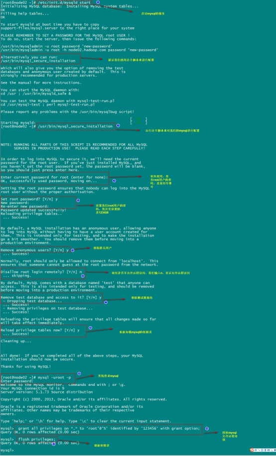

### 1:三台机器安装jdk

####1.1 查看自带的openjdk并卸载

~~~shell
rpm -qa | grep java
rpm -e java-1.6.0-openjdk-1.6.0.41-1.13.13.1.el6_8.x86_64 tzdata-java-2016j-1.el6.noarch java-1.7.0-openjdk-1.7.0.131-2.6.9.0.el6_8.x86_64 --nodeps
~~~

####1.2 创建安装目录

    ~~~shell
mkdir -p /export/softwares  #软件包存放目录
mkdir -p /export/servers    #安装目录
    ~~~

####1.3上传并 解压

~~~shell
#上传jdk到/export/softwares路径下去，并解压
tar -zxvf jdk-8u141-linux-x64.tar.gz -C ../servers/
~~~

####1.4 配置环境变量

~~~shell
vim /etc/profile
~~~

添加如下内容

~~~shell
export JAVA_HOME=/export/servers/jdk1.8.0_141
export PATH=:$JAVA_HOME/bin:$PATH
~~~

**[修改完成之后记得  source /etc/profile生效]()**

~~~shell
source /etc/profile
~~~

---

###2:mysql的安装

第一步：在线安装mysql相关的软件包

~~~shell
yum  install  mysql  mysql-server  mysql-devel
~~~

第二步：启动mysql的服务

~~~shell
/etc/init.d/mysqld start
~~~

第三步：通过mysql安装自带脚本进行设置

~~~shell
/usr/bin/mysql_secure_installation
~~~

第四步：进入mysql的客户端然后进行授权

~~~shell
grant all privileges on *.* to 'root'@'%' identified by '123456' with grant option;
flush privileges;
~~~

 