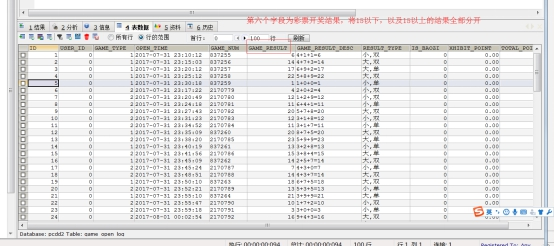

##  WordCount

> 需求: 在一堆给定的文本文件中统计输出每一个单词出现的总次数

##### Step 1. 数据格式准备

1. 创建一个新的文件
  ```shell
  cd /export/servers
  vim wordcount.txt
  ```

2. 向其中放入以下内容并保存
  ```text
  hello,world,hadoop
  hive,sqoop,flume,hello
  kitty,tom,jerry,world
  hadoop
  ```

3. 上传到 HDFS
  ```shell
  hdfs dfs -mkdir /wordcount/
  hdfs dfs -put wordcount.txt /wordcount/
  
  ```

##### Step 2. Mapper

```java
public class WordCountMapper extends Mapper<LongWritable,Text,Text,LongWritable> {
    @Override
    public void map(LongWritable key, Text value, Context context) throws IOException, InterruptedException {
        String line = value.toString();
        String[] split = line.split(",");
        for (String word : split) {
            context.write(new Text(word),new LongWritable(1));
        }

    }
}
```

##### Step 3. Reducer

```java
public class WordCountReducer extends Reducer<Text,LongWritable,Text,LongWritable> {
    /**
     * 自定义我们的reduce逻辑
     * 所有的key都是我们的单词，所有的values都是我们单词出现的次数
     * @param key
     * @param values
     * @param context
     * @throws IOException
     * @throws InterruptedException
     */
    @Override
    protected void reduce(Text key, Iterable<LongWritable> values, Context context) throws IOException, InterruptedException {
        long count = 0;
        for (LongWritable value : values) {
            count += value.get();
        }
        context.write(key,new LongWritable(count));
    }
}
```

##### Step 4. 定义主类, 描述 Job 并提交 Job

```java
public class JobMain extends Configured implements Tool {
    @Override
    public int run(String[] args) throws Exception {
        Job job = Job.getInstance(super.getConf(), JobMain.class.getSimpleName());
        //打包到集群上面运行时候，必须要添加以下配置，指定程序的main函数
        job.setJarByClass(JobMain.class);
        //第一步：读取输入文件解析成key，value对
        job.setInputFormatClass(TextInputFormat.class);
        TextInputFormat.addInputPath(job,new Path("hdfs://192.168.52.250:8020/wordcount"));

        //第二步：设置我们的mapper类
        job.setMapperClass(WordCountMapper.class);
        //设置我们map阶段完成之后的输出类型
        job.setMapOutputKeyClass(Text.class);
        job.setMapOutputValueClass(LongWritable.class);
        //第三步，第四步，第五步，第六步，省略
        //第七步：设置我们的reduce类
        job.setReducerClass(WordCountReducer.class);
        //设置我们reduce阶段完成之后的输出类型
        job.setOutputKeyClass(Text.class);
        job.setOutputValueClass(LongWritable.class);
        //第八步：设置输出类以及输出路径
        job.setOutputFormatClass(TextOutputFormat.class);
        TextOutputFormat.setOutputPath(job,new Path("hdfs://192.168.52.250:8020/wordcount_out"));
        boolean b = job.waitForCompletion(true);
        return b?0:1;
    }

    /**
     * 程序main函数的入口类
     * @param args
     * @throws Exception
     */
    public static void main(String[] args) throws Exception {
        Configuration configuration = new Configuration();
        Tool tool  =  new JobMain();
        int run = ToolRunner.run(configuration, tool, args);
        System.exit(run);
    }
}
```

##  MapReduce 运行模式

##### 集群运行模式

1. 将 MapReduce 程序提交给 Yarn 集群, 分发到很多的节点上并发执行
2. 处理的数据和输出结果应该位于 HDFS 文件系统
3. 提交集群的实现步骤: 将程序打成JAR包，并上传，然后在集群上用hadoop命令启动

```shell
hadoop jar hadoop_hdfs_operate-1.0-SNAPSHOT.jar  cn.itcast.mapreduce.JobMain
```

##### 本地运行模式

1. MapReduce 程序是在本地以单进程的形式运行
2. 处理的数据及输出结果在本地文件系统

```java
TextInputFormat.addInputPath(job,new Path("file:///E:\\mapreduce\\input"));
TextOutputFormat.setOutputPath(job,new Path("file:///E:\\mapreduce\\output"));
```

## MapReduce 分区

####分区概述

在 MapReduce 中, 通过我们指定分区, 会将同一个分区的数据发送到同一个 Reduce 当中进行处理

例如: 为了数据的统计, 可以把一批类似的数据发送到同一个 Reduce 当中, 在同一个 Reduce 当中统计相同类型的数据, 就可以实现类似的数据分区和统计等

其实就是相同类型的数据, 有共性的数据, 送到一起去处理

Reduce 当中默认的分区只有一个


需求：将以下数据进行分开处理

详细数据参见partition.csv  这个文本文件，其中第五个字段表示开奖结果数值，现在需求将15以上的结果以及15以下的结果进行分开成两个文件进行保存

 

####分区步骤：

#####Step 1. 定义 Mapper

这个 Mapper 程序不做任何逻辑, 也不对 Key-Value 做任何改变, 只是接收数据, 然后往下发送

```java
public class MyMapper extends Mapper<LongWritable,Text,Text,NullWritable>{
    @Override
    protected void map(LongWritable key, Text value, Context context) throws IOException, InterruptedException {
        context.write(value,NullWritable.get());
    }
}
```

##### Step 2. 自定义 Partitioner

主要的逻辑就在这里, 这也是这个案例的意义, 通过 Partitioner 将数据分发给不同的 Reducer

~~~java
/**
 * 这里的输入类型与我们map阶段的输出类型相同
 */
public class MyPartitioner extends Partitioner<Text,NullWritable>{
    /**
     * 返回值表示我们的数据要去到哪个分区
     * 返回值只是一个分区的标记，标记所有相同的数据去到指定的分区
     */
    @Override
    public int getPartition(Text text, NullWritable nullWritable, int i) {
        String result = text.toString().split("\t")[5];
        if (Integer.parseInt(result) > 15){
            return 1;
        }else{
            return 0;
        }
    }
}
~~~

##### Step 3. 定义 Reducer 逻辑

这个 Reducer 也不做任何处理, 将数据原封不动的输出即可

```java
public class MyReducer extends Reducer<Text,NullWritable,Text,NullWritable> {
    @Override
    protected void reduce(Text key, Iterable<NullWritable> values, Context context) throws IOException, InterruptedException {
        context.write(key,NullWritable.get());
    }
}
```

##### Step 4. 主类中设置分区类和ReduceTask个数 

```java
public class PartitionMain  extends Configured implements Tool {
    public static void main(String[] args) throws  Exception{
        int run = ToolRunner.run(new Configuration(), new PartitionMain(), args);
        System.exit(run);
    }
    @Override
    public int run(String[] args) throws Exception {
        Job job = Job.getInstance(super.getConf(), PartitionMain.class.getSimpleName());
        job.setJarByClass(PartitionMain.class);
        job.setInputFormatClass(TextInputFormat.class);
        job.setOutputFormatClass(TextOutputFormat.class);
        TextInputFormat.addInputPath(job,new Path("hdfs://192.168.52.250:8020/partitioner"));
        TextOutputFormat.setOutputPath(job,new Path("hdfs://192.168.52.250:8020/outpartition"));
        job.setMapperClass(MyMapper.class);
        job.setMapOutputKeyClass(Text.class);
        job.setMapOutputValueClass(NullWritable.class);
        job.setOutputKeyClass(Text.class);
        job.setMapOutputValueClass(NullWritable.class);
        job.setReducerClass(MyReducer.class);
        /**
         * 设置我们的分区类，以及我们的reducetask的个数，注意reduceTask的个数一定要与我们的
         * 分区数保持一致
         */
        job.setPartitionerClass(MyPartitioner.class);
        job.setNumReduceTasks(2);
        boolean b = job.waitForCompletion(true);
        return b?0:1;
    }
}
```
##  MapReduce 中的计数器

计数器是收集作业统计信息的有效手段之一，用于质量控制或应用级统计。计数器还可辅助诊断系统故障。如果需要将日志信息传输到 map 或 reduce 任务， 更好的方法通常是看能否用一个计数器值来记录某一特定事件的发生。对于大型分布式作业而言，使用计数器更为方便。除了因为获取计数器值比输出日志更方便，还有根据计数器值统计特定事件的发生次数要比分析一堆日志文件容易得多。

hadoop内置计数器列表

| **MapReduce任务计数器** | **org.apache.hadoop.mapreduce.TaskCounter**                  |
| ----------------------- | ------------------------------------------------------------ |
| 文件系统计数器          | org.apache.hadoop.mapreduce.FileSystemCounter                |
| FileInputFormat计数器   | org.apache.hadoop.mapreduce.lib.input.FileInputFormatCounter |
| FileOutputFormat计数器  | org.apache.hadoop.mapreduce.lib.output.FileOutputFormatCounter |
| 作业计数器              | org.apache.hadoop.mapreduce.JobCounter                       |

**每次mapreduce执行完成之后，我们都会看到一些日志记录出来，其中最重要的一些日志记录如下截图**


**所有的这些都是MapReduce的计数器的功能，既然MapReduce当中有计数器的功能，我们如何实现自己的计数器？？？**

> **需求：以以上分区代码为案例，统计map接收到的数据记录条数**

#####第一种方式

**第一种方式定义计数器，通过context上下文对象可以获取我们的计数器，进行记录**
**通过context上下文对象，在map端使用计数器进行统计**

```java
public class PartitionMapper  extends Mapper<LongWritable,Text,Text,NullWritable>{
    //map方法将K1和V1转为K2和V2
    @Override
    protected void map(LongWritable key, Text value, Context context) throws Exception{
        Counter counter = context.getCounter("MR_COUNT", "MyRecordCounter");
        counter.increment(1L);
        context.write(value,NullWritable.get());
    }
}
```

**运行程序之后就可以看到我们自定义的计数器在map阶段读取了七条数据**

	

##### **第二种方式**

**通过enum枚举类型来定义计数器**
统计reduce端数据的输入的key有多少个

```java
public class PartitionerReducer extends Reducer<Text,NullWritable,Text,NullWritable> {
   public static enum Counter{
       MY_REDUCE_INPUT_RECORDS,MY_REDUCE_INPUT_BYTES
   }
    @Override
    protected void reduce(Text key, Iterable<NullWritable> values, Context context) throws IOException, InterruptedException {
       context.getCounter(Counter.MY_REDUCE_INPUT_RECORDS).increment(1L);
       context.write(key, NullWritable.get());
    }
}
```

	