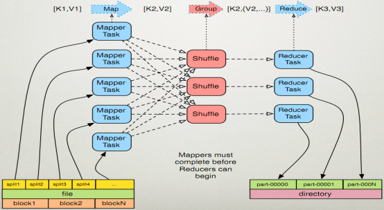
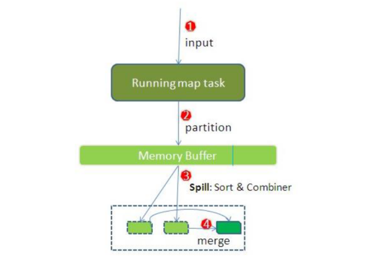
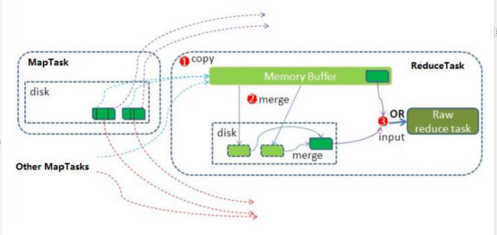
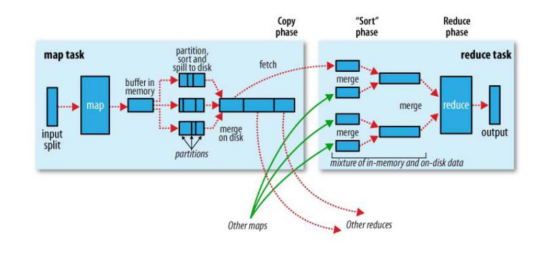

## 1 .MapReduce的运行机制详解

### 1.1:MapTask 工作机制

	

	

整个Map阶段流程大体如上图所示。

简单概述：inputFile通过split被逻辑切分为多个split文件，通过Record按行读取内容给map（用户自己实现的）进行处理，数据被map处理结束之后交给OutputCollector收集器，对其结果key进行分区（默认使用hash分区），然后写入buffer，每个map task都有一个内存缓冲区，存储着map的输出结果，当缓冲区快满的时候需要将缓冲区的数据以一个临时文件的方式存放到磁盘，当整个map task结束后再对磁盘中这个map task产生的所有临时文件做合并，生成最终的正式输出文件，然后等待reduce task来拉数据

##### 详细步骤

1. 读取数据组件 **InputFormat** (默认 TextInputFormat) 会通过 `getSplits` 方法对输入目录中文件进行逻辑切片规划得到 `block`, 有多少个 `block`就对应启动多少个 `MapTask`. 

2. 将输入文件切分为 `block` 之后, 由 `RecordReader` 对象 (默认是LineRecordReader) 进行**读取**, 以 `\n` 作为分隔符, 读取一行数据, 返回 `<key，value>`. Key 表示每行首字符偏移值, Value 表示这一行文本内容

3. 读取 `block` 返回 `<key,value>`, **进入用户自己继承的 Mapper 类中**，执行用户重写的 map 函数, RecordReader 读取一行这里调用一次

4. Mapper 逻辑结束之后, 将 Mapper 的每条结果通过 `context.write` 进行collect数据收集. 在 collect 中, 会先对其进行分区处理，默认使用 **HashPartitioner**

   - > MapReduce 提供 `Partitioner` 接口, 它的作用就是根据 `Key` 或 `Value` 及 `Reducer` 的数量来决定当前的这对输出数据最终应该交由哪个 `Reduce task` 处理, 默认对 Key Hash 后再以 Reducer 数量取模. 默认的取模方式只是为了平均 Reducer 的处理能力, 如果用户自己对 Partitioner 有需求, 可以订制并设置到 Job 上

5. 接下来, 会将数据写入内存, 内存中这片区域叫做环形缓冲区, 缓冲区的作用是批量收集 Mapper 结果, 减少磁盘 IO 的影响. 我们的 **Key/Value 对以及 Partition 的结果都会被写入缓冲区**. 当然, 写入之前，Key 与 Value 值都会被序列化成字节数组

   - > 环形缓冲区其实是一个数组, 数组中存放着 Key, Value 的序列化数据和 Key, Value 的元数据信息, 包括 Partition, Key 的起始位置, Value 的起始位置以及 Value 的长度. 环形结构是一个抽象概念

   - > 缓冲区是有大小限制, 默认是 100MB. 当 Mapper 的输出结果很多时, 就可能会撑爆内存, 所以需要在一定条件下将缓冲区中的数据临时写入磁盘, 然后重新利用这块缓冲区. 这个从内存往磁盘写数据的过程被称为 Spill, 中文可译为溢写. 这个溢写是由单独线程来完成, 不影响往缓冲区写 Mapper 结果的线程. 溢写线程启动时不应该阻止 Mapper 的结果输出, 所以整个缓冲区有个溢写的比例 `spill.percent`. 这个比例默认是 0.8, 也就是当缓冲区的数据已经达到阈值 `buffer size * spill percent = 100MB * 0.8 = 80MB`, 溢写线程启动, 锁定这 80MB 的内存, 执行溢写过程. Mapper 的输出结果还可以往剩下的 20MB 内存中写, 互不影响

6. 当溢写线程启动后, 需要**对这 80MB 空间内的 Key 做排序 (Sort)**. 排序是 MapReduce 模型默认的行为, 这里的排序也是对序列化的字节做的排序

   - > 如果 Job 设置过 Combiner, 那么现在就是使用 Combiner 的时候了. 将有相同 Key 的 Key/Value 对的 Value 加起来, 减少溢写到磁盘的数据量. Combiner 会优化 MapReduce 的中间结果, 所以它在整个模型中会多次使用

   - > 那哪些场景才能使用 Combiner 呢? 从这里分析, Combiner 的输出是 Reducer 的输入, Combiner 绝不能改变最终的计算结果. Combiner 只应该用于那种 Reduce 的输入 Key/Value 与输出 Key/Value 类型完全一致, 且不影响最终结果的场景. 比如累加, 最大值等. Combiner 的使用一定得慎重, 如果用好, 它对 Job 执行效率有帮助, 反之会影响 Reducer 的最终结果

7. **合并溢写文件**, 每次溢写会在磁盘上生成一个临时文件 (写之前判断是否有 Combiner), 如果 Mapper 的输出结果真的很大, 有多次这样的溢写发生, 磁盘上相应的就会有多个临时文件存在. 当整个数据处理结束之后开始对磁盘中的临时文件进行 Merge 合并, 因为最终的文件只有一个, 写入磁盘, 并且为这个文件提供了一个索引文件, 以记录每个reduce对应数据的偏移量

##### 配置

| 配置                               | 默认值                           | 解释                       |
| ---------------------------------- | -------------------------------- | -------------------------- |
| `mapreduce.task.io.sort.mb`        | 100                              | 设置环型缓冲区的内存值大小 |
| `mapreduce.map.sort.spill.percent` | 0.8                              | 设置溢写的比例             |
| `mapreduce.cluster.local.dir`      | `${hadoop.tmp.dir}/mapred/local` | 溢写数据目录               |
| `mapreduce.task.io.sort.factor`    | 10                               | 设置一次合并多少个溢写文件 |

### 1.2 :ReduceTask 工作机制

	

Reduce 大致分为 copy、sort、reduce 三个阶段，重点在前两个阶段。copy 阶段包含一个 eventFetcher 来获取已完成的 map 列表，由 Fetcher 线程去 copy 数据，在此过程中会启动两个 merge 线程，分别为 inMemoryMerger 和 onDiskMerger，分别将内存中的数据 merge 到磁盘和将磁盘中的数据进行 merge。待数据 copy 完成之后，copy 阶段就完成了，开始进行 sort 阶段，sort 阶段主要是执行 finalMerge 操作，纯粹的 sort 阶段，完成之后就是 reduce 阶段，调用用户定义的 reduce 函数进行处理

##### 详细步骤

1. **`Copy阶段`**，简单地拉取数据。Reduce进程启动一些数据copy线程(Fetcher)，通过HTTP方式请求maptask获取属于自己的文件。
2. **`Merge阶段`**。这里的merge如map端的merge动作，只是数组中存放的是不同map端copy来的数值。Copy过来的数据会先放入内存缓冲区中，这里的缓冲区大小要比map端的更为灵活。merge有三种形式：内存到内存；内存到磁盘；磁盘到磁盘。默认情况下第一种形式不启用。当内存中的数据量到达一定阈值，就启动内存到磁盘的merge。与map 端类似，这也是溢写的过程，这个过程中如果你设置有Combiner，也是会启用的，然后在磁盘中生成了众多的溢写文件。第二种merge方式一直在运行，直到没有map端的数据时才结束，然后启动第三种磁盘到磁盘的merge方式生成最终的文件。
3. **`合并排序`**。把分散的数据合并成一个大的数据后，还会再对合并后的数据排序。
4. **`对排序后的键值对调用reduce方法`**，键相等的键值对调用一次reduce方法，每次调用会产生零个或者多个键值对，最后把这些输出的键值对写入到HDFS文件中。

### 1.3:Shuffle 过程

map 阶段处理的数据如何传递给 reduce 阶段，是 MapReduce 框架中最关键的一个流程，这个流程就叫 shuffle
shuffle: 洗牌、发牌 ——（核心机制：数据分区，排序，分组，规约，合并等过程）

	

shuffle 是 Mapreduce 的核心，它分布在 Mapreduce 的 map 阶段和 reduce 阶段。一般把从 Map 产生输出开始到 Reduce 取得数据作为输入之前的过程称作 shuffle。

1. **`Collect阶段`**：将 MapTask 的结果输出到默认大小为 100M 的环形缓冲区，保存的是 key/value，Partition 分区信息等。
2. **`Spill阶段`**：当内存中的数据量达到一定的阀值的时候，就会将数据写入本地磁盘，在将数据写入磁盘之前需要对数据进行一次排序的操作，如果配置了 combiner，还会将有相同分区号和 key 的数据进行排序。
3. **`Merge阶段`**：把所有溢出的临时文件进行一次合并操作，以确保一个 MapTask 最终只产生一个中间数据文件。
4. **`Copy阶段`**：ReduceTask 启动 Fetcher 线程到已经完成 MapTask 的节点上复制一份属于自己的数据，这些数据默认会保存在内存的缓冲区中，当内存的缓冲区达到一定的阀值的时候，就会将数据写到磁盘之上。
5. **`Merge阶段`**：在 ReduceTask 远程复制数据的同时，会在后台开启两个线程对内存到本地的数据文件进行合并操作。
6. **`Sort阶段`**：在对数据进行合并的同时，会进行排序操作，由于 MapTask 阶段已经对数据进行了局部的排序，ReduceTask 只需保证 Copy 的数据的最终整体有效性即可。
   Shuffle 中的缓冲区大小会影响到 mapreduce 程序的执行效率，原则上说，缓冲区越大，磁盘io的次数越少，执行速度就越快
   缓冲区的大小可以通过参数调整,  参数：mapreduce.task.io.sort.mb  默认100M

## 2. 案例: Reduce 端实现 JOIN

### 2.1. 需求

> 假如数据量巨大，两表的数据是以文件的形式存储在 HDFS 中, 需要用 MapReduce 程序来实现以下 SQL 查询运算
>
> ```sql
> select  a.id,a.date,b.name,b.category_id,b.price from t_order a left join t_product b on a.pid = b.id
> ```

##### 商品表

| id    | pname  | category_id | price |
| ----- | ------ | ----------- | ----- |
| P0001 | 小米5  | 1000        | 2000  |
| P0002 | 锤子T1 | 1000        | 3000  |

##### 订单数据表

| id   | date     | pid   | amount |
| ---- | -------- | ----- | ------ |
| 1001 | 20150710 | P0001 | 2      |
| 1002 | 20150710 | P0002 | 3      |

### 2.2 实现步骤

通过将关联的条件作为map输出的key，将两表满足join条件的数据并携带数据所来源的文件信息，发往同一个reduce task，在reduce中进行数据的串联

#### Step 1: 定义 Mapper

```java
public class ReduceJoinMapper extends Mapper<LongWritable,Text,Text,Text> {
    @Override
    protected void map(LongWritable key, Text value, Context context) throws IOException, InterruptedException {
        //1:判断数据来自哪个文件
        FileSplit fileSplit = (FileSplit) context.getInputSplit();
        String fileName = fileSplit.getPath().getName();
        if(fileName.equals("product.txt")){
            //数据来自商品表
            //2:将K1和V1转为K2和V2,写入上下文中
            String[] split = value.toString().split(",");
            String productId = split[0];

            context.write(new Text(productId), value);

        }else{
            //数据来自订单表
            //2:将K1和V1转为K2和V2,写入上下文中
            String[] split = value.toString().split(",");
            String productId = split[2];

            context.write(new Text(productId), value);

        }

    }
}

```

#### Step 2: 定义 Reducer

```java
public class ReduceJoinMapper extends Mapper<LongWritable,Text,Text,Text> {
    @Override
    protected void map(LongWritable key, Text value, Context context) throws IOException, InterruptedException {
        //1:判断数据来自哪个文件

        FileSplit fileSplit = (FileSplit) context.getInputSplit();
        String fileName = fileSplit.getPath().getName();
        if(fileName.equals("product.txt")){
            //数据来自商品表
            //2:将K1和V1转为K2和V2,写入上下文中
            String[] split = value.toString().split(",");
            String productId = split[0];

            context.write(new Text(productId), value);

        }else{
            //数据来自订单表
            //2:将K1和V1转为K2和V2,写入上下文中
            String[] split = value.toString().split(",");
            String productId = split[2];

            context.write(new Text(productId), value);

        }


    }
}
```

####Step 3: 定义主类

```java
public class ReduceJoinReducer extends Reducer<Text,Text,Text,Text> {
    @Override
    protected void reduce(Text key, Iterable<Text> values, Context context) throws IOException, InterruptedException {
       //1:遍历集合,获取V3 (first +second)
        String first = "";
        String second = "";
        for (Text value : values) {
            if(value.toString().startsWith("p")){
                first = value.toString();
            }else{
                second += value.toString();
            }

        }
        //2:将K3和V3写入上下文中
        context.write(key, new Text(first+"\t"+second));
    }
}
```

## 3. 案例: Map端实现 JOIN

#### 3.1 概述

​	适用于关联表中有小表的情形.

​	使用分布式缓存,可以将小表分发到所有的map节点，这样，map节点就可以在本地对自己所读到的大表数据进行join并输出最终结果，可以大大提高join操作的并发度，加快处理速度

#### 3.2 实现步骤

  先在mapper类中预先定义好小表，进行join

 引入实际场景中的解决方案：一次加载数据库或者用

##### Step 1：定义Mapper

~~~java
public class MapJoinMapper extends Mapper<LongWritable,Text,Text,Text>{
    private HashMap<String, String> map = new HashMap<>();

    //第一件事情:将分布式缓存的小表数据读取到本地Map集合(只需要做一次)

    @Override
    protected void setup(Context context) throws IOException, InterruptedException {
        //1:获取分布式缓存文件列表
        URI[] cacheFiles =  context.getCacheFiles();

        //2:获取指定的分布式缓存文件的文件系统(FileSystem)
        FileSystem fileSystem = FileSystem.get(cacheFiles[0], context.getConfiguration());

        //3:获取文件的输入流
        FSDataInputStream inputStream = fileSystem.open(new Path(cacheFiles[0]));

        //4:读取文件内容, 并将数据存入Map集合
           //4.1 将字节输入流转为字符缓冲流FSDataInputStream --->BufferedReader
        BufferedReader bufferedReader = new BufferedReader(new InputStreamReader(inputStream));
           //4.2 读取小表文件内容,以行位单位,并将读取的数据存入map集合


        String line = null;
        while((line = bufferedReader.readLine()) != null){
            String[] split = line.split(",");

            map.put(split[0], line);

        }


        //5:关闭流
        bufferedReader.close();
        fileSystem.close();


    }

    //第二件事情:对大表的处理业务逻辑,而且要实现大表和小表的join操作

    @Override
    protected void map(LongWritable key, Text value, Context context) throws IOException, InterruptedException {
            //1:从行文本数据中获取商品的id: p0001 , p0002  得到了K2
            String[] split = value.toString().split(",");
            String productId = split[2];  //K2

            //2:在Map集合中,将商品的id作为键,获取值(商品的行文本数据) ,将value和值拼接,得到V2
            String productLine = map.get(productId);
            String valueLine = productLine+"\t"+value.toString(); //V2
            //3:将K2和V2写入上下文中
            context.write(new Text(productId), new Text(valueLine));
    }
}

~~~

##### Step 2：定义主类

~~~java
public class JobMain  extends Configured implements Tool{
    @Override
    public int run(String[] args) throws Exception {
        //1:获取job对象
        Job job = Job.getInstance(super.getConf(), "map_join_job");

        //2:设置job对象(将小表放在分布式缓存中)
            //将小表放在分布式缓存中
           // DistributedCache.addCacheFile(new URI("hdfs://node01:8020/cache_file/product.txt"), super.getConf());
           job.addCacheFile(new URI("hdfs://node01:8020/cache_file/product.txt"));

           //第一步:设置输入类和输入的路径
            job.setInputFormatClass(TextInputFormat.class);
            TextInputFormat.addInputPath(job, new Path("file:///D:\\input\\map_join_input"));
            //第二步:设置Mapper类和数据类型
            job.setMapperClass(MapJoinMapper.class);
            job.setMapOutputKeyClass(Text.class);
            job.setMapOutputValueClass(Text.class);

            //第八步:设置输出类和输出路径
            job.setOutputFormatClass(TextOutputFormat.class);
            TextOutputFormat.setOutputPath(job, new Path("file:///D:\\out\\map_join_out"));


        //3:等待任务结束
        boolean bl = job.waitForCompletion(true);
        return bl ? 0 :1;
    }

    public static void main(String[] args) throws Exception {
        Configuration configuration = new Configuration();
        //启动job任务
        int run = ToolRunner.run(configuration, new JobMain(), args);
        System.exit(run);
    }
}
~~~

  

## 4. 案例:求共同好友

### 4.1 需求分析

以下是qq的好友列表数据，冒号前是一个用户，冒号后是该用户的所有好友（数据中的好友关系是单向的）

~~~java
A:B,C,D,F,E,O
B:A,C,E,K
C:A,B,D,E,I 
D:A,E,F,L
E:B,C,D,M,L
F:A,B,C,D,E,O,M
G:A,C,D,E,F
H:A,C,D,E,O
I:A,O
J:B,O
K:A,C,D
L:D,E,F
M:E,F,G
O:A,H,I,J
~~~

求出哪些人两两之间有共同好友，及他俩的共同好友都有谁？

### 4.2 实现步骤

##### 第一步：代码实现

**Mapper类**

~~~java
public class Step1Mapper extends Mapper<LongWritable,Text,Text,Text> {
    @Override
    protected void map(LongWritable key, Text value, Context context) throws IOException, InterruptedException {
         //1:以冒号拆分行文本数据: 冒号左边就是V2
        String[] split = value.toString().split(":");
        String userStr = split[0];

        //2:将冒号右边的字符串以逗号拆分,每个成员就是K2
        String[] split1 = split[1].split(",");
        for (String s : split1) {
            //3:将K2和v2写入上下文中
            context.write(new Text(s), new Text(userStr));
        }
    }
}
~~~

**Reducer类:**

~~~java
public class Step1Reducer extends Reducer<Text,Text,Text,Text> {
    @Override
    protected void reduce(Text key, Iterable<Text> values, Context context) throws IOException, InterruptedException {
        //1:遍历集合,并将每一个元素拼接,得到K3
        StringBuffer buffer = new StringBuffer();

        for (Text value : values) {
            buffer.append(value.toString()).append("-");
        }
        //2:K2就是V3
        //3:将K3和V3写入上下文中
        context.write(new Text(buffer.toString()), key);
    }
}
~~~

**JobMain:**

~~~java
public class JobMain extends Configured implements Tool {
    @Override
    public int run(String[] args) throws Exception {
        //1:获取Job对象
        Job job = Job.getInstance(super.getConf(), "common_friends_step1_job");

        //2:设置job任务
            //第一步:设置输入类和输入路径
            job.setInputFormatClass(TextInputFormat.class);
            TextInputFormat.addInputPath(job, new Path("file:///D:\\input\\common_friends_step1_input"));

            //第二步:设置Mapper类和数据类型
            job.setMapperClass(Step1Mapper.class);
            job.setMapOutputKeyClass(Text.class);
            job.setMapOutputValueClass(Text.class);

            //第三,四,五,六

            //第七步:设置Reducer类和数据类型
            job.setReducerClass(Step1Reducer.class);
            job.setOutputKeyClass(Text.class);
            job.setOutputValueClass(Text.class);

            //第八步:设置输出类和输出的路径
            job.setOutputFormatClass(TextOutputFormat.class);
            TextOutputFormat.setOutputPath(job, new Path("file:///D:\\out\\common_friends_step1_out"));

        //3:等待job任务结束
        boolean bl = job.waitForCompletion(true);


        return bl ? 0: 1;
    }

    public static void main(String[] args) throws Exception {
        Configuration configuration = new Configuration();

        //启动job任务
        int run = ToolRunner.run(configuration, new JobMain(), args);

        System.exit(run);
    }
}
~~~

##### 第二步：代码实现

**Mapper类**

```java
public class Step2Mapper extends Mapper<LongWritable,Text,Text,Text> {
    /*
     K1           V1

     0            A-F-C-J-E-	B
    ----------------------------------

     K2             V2
     A-C            B
     A-E            B
     A-F            B
     C-E            B

     */
    @Override
    protected void map(LongWritable key, Text value, Context context) throws IOException, InterruptedException {
        //1:拆分行文本数据,结果的第二部分可以得到V2
        String[] split = value.toString().split("\t");
        String   friendStr =split[1];

        //2:继续以'-'为分隔符拆分行文本数据第一部分,得到数组
        String[] userArray = split[0].split("-");

        //3:对数组做一个排序
        Arrays.sort(userArray);

        //4:对数组中的元素进行两两组合,得到K2
        /*
          A-E-C ----->  A  C  E

          A  C  E
            A  C  E

         */
        for (int i = 0; i <userArray.length -1 ; i++) {
            for (int j = i+1; j  < userArray.length ; j++) {
                //5:将K2和V2写入上下文中
                context.write(new Text(userArray[i] +"-"+userArray[j]), new Text(friendStr));
            }

        }

    }
}

```

**Reducer类:**

```java
public class Step2Reducer extends Reducer<Text,Text,Text,Text> {
    @Override
    protected void reduce(Text key, Iterable<Text> values, Context context) throws IOException, InterruptedException {
        //1:原来的K2就是K3
        //2:将集合进行遍历,将集合中的元素拼接,得到V3
        StringBuffer buffer = new StringBuffer();
        for (Text value : values) {
            buffer.append(value.toString()).append("-");
            
        }
        //3:将K3和V3写入上下文中
        context.write(key, new Text(buffer.toString()));
    }
}
```

**JobMain:**

```java
public class JobMain extends Configured implements Tool {
    @Override
    public int run(String[] args) throws Exception {
        //1:获取Job对象
        Job job = Job.getInstance(super.getConf(), "common_friends_step2_job");

        //2:设置job任务
            //第一步:设置输入类和输入路径
            job.setInputFormatClass(TextInputFormat.class);
            TextInputFormat.addInputPath(job, new Path("file:///D:\\out\\common_friends_step1_out"));

            //第二步:设置Mapper类和数据类型
            job.setMapperClass(Step2Mapper.class);
            job.setMapOutputKeyClass(Text.class);
            job.setMapOutputValueClass(Text.class);

            //第三,四,五,六

            //第七步:设置Reducer类和数据类型
            job.setReducerClass(Step2Reducer.class);
            job.setOutputKeyClass(Text.class);
            job.setOutputValueClass(Text.class);

            //第八步:设置输出类和输出的路径
            job.setOutputFormatClass(TextOutputFormat.class);
            TextOutputFormat.setOutputPath(job, new Path("file:///D:\\out\\common_friends_step2_out"));

        //3:等待job任务结束
        boolean bl = job.waitForCompletion(true);
        return bl ? 0: 1;
    }

    public static void main(String[] args) throws Exception {
        Configuration configuration = new Configuration();
        //启动job任务
        int run = ToolRunner.run(configuration, new JobMain(), args);
        System.exit(run);
    }
}
```


