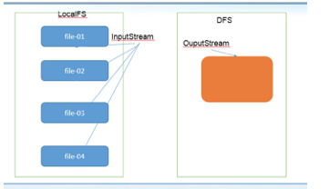
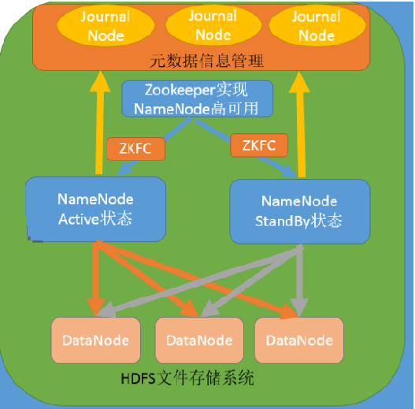
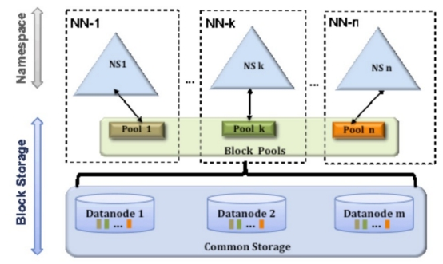

# Hadoop 核心-HDFS

##1:HDFS 的 API 操作

###1.1 配置Windows下Hadoop环境

在windows系统需要配置hadoop运行环境，否则直接运行代码会出现以下问题:

`缺少winutils.exe`

~~~shell
Could not locate executable null \bin\winutils.exe in the hadoop binaries 
~~~

`缺少hadoop.dll`

~~~shell
Unable to load native-hadoop library for your platform… using builtin-Java classes where applicable  
~~~

步骤:

第一步：将hadoop2.7.5文件夹拷贝到一个没有中文没有空格的路径下面

第二步：在windows上面配置hadoop的环境变量： HADOOP_HOME，并将%HADOOP_HOME%\bin添加到path中

第三步：把hadoop2.7.5文件夹中bin目录下的hadoop.dll文件放到系统盘:  C:\Windows\System32 目录

第四步：关闭windows重启

###1.2 导入 Maven 依赖

```xml

  	 <dependencies>
      	<dependency>
            <groupId>org.apache.hadoop</groupId>
            <artifactId>hadoop-common</artifactId>
            <version>2.7.5</version>
	    </dependency>
        <dependency>
            <groupId>org.apache.hadoop</groupId>
            <artifactId>hadoop-client</artifactId>
            <version>2.7.5</version>
		</dependency>
        <dependency>
            <groupId>org.apache.hadoop</groupId>
            <artifactId>hadoop-hdfs</artifactId>
            <version>2.7.5</version>
		</dependency>
		<dependency>
            <groupId>org.apache.hadoop</groupId>
            <artifactId>hadoop-mapreduce-client-core</artifactId>
            <version>2.7.5</version>
		</dependency>
        <dependency>
            <groupId>junit</groupId>
            <artifactId>junit</artifactId>
            <version>RELEASE</version>
        </dependency>
    </dependencies>
    <build>
        <plugins>
            <plugin>
                <groupId>org.apache.maven.plugins</groupId>
                <artifactId>maven-compiler-plugin</artifactId>
                <version>3.1</version>
                <configuration>
                    <source>1.8</source>
                    <target>1.8</target>
                    <encoding>UTF-8</encoding>
                    <!--    <verbal>true</verbal>-->
                </configuration>
            </plugin>
            <plugin>
                <groupId>org.apache.maven.plugins</groupId>
                <artifactId>maven-shade-plugin</artifactId>
                <version>2.4.3</version>
                <executions>
                    <execution>
                        <phase>package</phase>
                        <goals>
                            <goal>shade</goal>
                        </goals>
                        <configuration>
                            <minimizeJar>true</minimizeJar>
                        </configuration>
                    </execution>
                </executions>
            </plugin>

        </plugins>
    </build>
```


###1.3 使用url方式访问数据（了解）

~~~java
@Test
public void demo1()throws  Exception{
    //第一步：注册hdfs 的url
    URL.setURLStreamHandlerFactory(new FsUrlStreamHandlerFactory());

    //获取文件输入流
    InputStream inputStream  = new URL("hdfs://node01:8020/a.txt").openStream();
    //获取文件输出流
    FileOutputStream outputStream = new FileOutputStream(new File("D:\\hello.txt"));

    //实现文件的拷贝
    IOUtils.copy(inputStream, outputStream);

    //关闭流
    IOUtils.closeQuietly(inputStream);
    IOUtils.closeQuietly(outputStream);
}
~~~

###1.4 **使用**文件系统方式访问数据（掌握）

####1.4.1 涉及的主要类

在 Java 中操作 HDFS, 主要涉及以下 Class:

* `Configuration`
  * 该类的对象封转了客户端或者服务器的配置
* `FileSystem`
  * 该类的对象是一个文件系统对象, 可以用该对象的一些方法来对文件进行操作, 通过 FileSystem 的静态方法 get 获得该对象
    ```java
    FileSystem fs = FileSystem.get(conf)
    ```
    * `get` 方法从 `conf` 中的一个参数 `fs.defaultFS` 的配置值判断具体是什么类型的文件系统
    * 如果我们的代码中没有指定 `fs.defaultFS`, 并且工程 ClassPath 下也没有给定相应的配置, `conf` 中的默认值就来自于 Hadoop 的 Jar 包中的 `core-default.xml`
    * 默认值为 `file:/// `, 则获取的不是一个 DistributedFileSystem 的实例, 而是一个本地文件系统的客户端对象

#### 1.4.2  获取 FileSystem 的几种方式

* 第一种方式
```java
@Test
public void getFileSystem1() throws IOException {
    Configuration configuration = new Configuration();
    //指定我们使用的文件系统类型:
    configuration.set("fs.defaultFS", "hdfs://node01:8020/");

    //获取指定的文件系统
    FileSystem fileSystem = FileSystem.get(configuration);
    System.out.println(fileSystem.toString());

}
```

* 第二种方式
```java
@Test
public void getFileSystem2() throws  Exception{
    FileSystem fileSystem = FileSystem.get(new URI("hdfs://node01:8020"), new       Configuration());
    System.out.println("fileSystem:"+fileSystem);
}
```

* 第三种方式
```java
@Test
public void getFileSystem3() throws  Exception{
    Configuration configuration = new Configuration();
    configuration.set("fs.defaultFS", "hdfs://node01:8020");
    FileSystem fileSystem = FileSystem.newInstance(configuration);
    System.out.println(fileSystem.toString());
}
```

* 第四种方式
```java
//@Test
public void getFileSystem4() throws  Exception{
    FileSystem fileSystem = FileSystem.newInstance(new URI("hdfs://node01:8020") ,new Configuration());
    System.out.println(fileSystem.toString());
}
```

#### 1.4.3  遍历 HDFS 中所有文件

* 使用 API 遍历
```java
@Test
public void listMyFiles()throws Exception{
    //获取fileSystem类
    FileSystem fileSystem = FileSystem.get(new URI("hdfs://node01:8020"), new Configuration());
    //获取RemoteIterator 得到所有的文件或者文件夹，第一个参数指定遍历的路径，第二个参数表示是否要递归遍历
    RemoteIterator<LocatedFileStatus> locatedFileStatusRemoteIterator = fileSystem.listFiles(new Path("/"), true);
    while (locatedFileStatusRemoteIterator.hasNext()){
        LocatedFileStatus next = locatedFileStatusRemoteIterator.next();
        System.out.println(next.getPath().toString());
    }
    fileSystem.close();
}
```

#### 1.4.4  HDFS 上创建文件夹

```java
@Test
public void mkdirs() throws  Exception{
    FileSystem fileSystem = FileSystem.get(new URI("hdfs://node01:8020"), new Configuration());
    boolean mkdirs = fileSystem.mkdirs(new Path("/hello/mydir/test"));
    fileSystem.close();
}
```

#### 1.4.4 下载文件

```java
@Test
public void getFileToLocal()throws  Exception{
    FileSystem fileSystem = FileSystem.get(new URI("hdfs://node01:8020"), new Configuration());
    FSDataInputStream inputStream = fileSystem.open(new Path("/timer.txt"));
    FileOutputStream  outputStream = new FileOutputStream(new File("e:\\timer.txt"));
    IOUtils.copy(inputStream,outputStream );
    IOUtils.closeQuietly(inputStream);
    IOUtils.closeQuietly(outputStream);
    fileSystem.close();
}
```

#### 1.4.5 HDFS 文件上传

```java
@Test
public void putData() throws  Exception{
    FileSystem fileSystem = FileSystem.get(new URI("hdfs://node01:8020"), new Configuration());
    fileSystem.copyFromLocalFile(new Path("file:///c:\\install.log"),new Path("/hello/mydir/test"));
    fileSystem.close();
}
```


#### 1.4.6 hdfs访问权限控制

1. 停止hdfs集群，在node01机器上执行以下命令
```shell
cd /export/servers/hadoop-2.7.5
sbin/stop-dfs.sh
```
2. 修改node01机器上的hdfs-site.xml当中的配置文件
```shell
cd /export/servers/hadoop-2.7.5/etc/hadoop
vim hdfs-site.xml
```
```xml
<property>
	<name>dfs.permissions.enabled</name>
	<value>true</value>
</property>
```
3. 修改完成之后配置文件发送到其他机器上面去
```shell
scp hdfs-site.xml node02:$PWD
scp hdfs-site.xml node03:$PWD
```
4. 重启hdfs集群
```shell
cd /export/servers/hadoop-2.7.5
sbin/start-dfs.sh
```
5. 随意上传一些文件到我们hadoop集群当中准备测试使用
```shell
cd /export/servers/hadoop-2.7.5/etc/hadoop
hdfs dfs -mkdir /config
hdfs dfs -put *.xml /config
hdfs dfs -chmod 600 /config/core-site.xml
```
6. 使用代码准备下载文件
```java
@Test
public void getConfig()throws  Exception{
    FileSystem fileSystem = FileSystem.get(new URI("hdfs://node01:8020"), new Configuration(),"hadoop");
    fileSystem.copyToLocalFile(new Path("/config/core-site.xml"),new Path("file:///c:/core-site.xml"));
    fileSystem.close();
}
```


#### 1.4.7 小文件合并

由于 Hadoop 擅长存储大文件，因为大文件的元数据信息比较少，如果 Hadoop 集群当中有大量的小文件，那么每个小文件都需要维护一份元数据信息，会大大的增加集群管理元数据的内存压力，所以在实际工作当中，如果有必要一定要将小文件合并成大文件进行一起处理

在我们的 HDFS 的 Shell 命令模式下，可以通过命令行将很多的 hdfs 文件合并成一个大文件下载到本地

```shell
cd /export/servers
hdfs dfs -getmerge /config/*.xml ./hello.xml
```

既然可以在下载的时候将这些小文件合并成一个大文件一起下载，那么肯定就可以在上传的时候将小文件合并到一个大文件里面去

	

```java
@Test
public void mergeFile() throws  Exception{
    //获取分布式文件系统
    FileSystem fileSystem = FileSystem.get(new URI("hdfs://192.168.52.250:8020"), new Configuration(),"root");
    FSDataOutputStream outputStream = fileSystem.create(new Path("/bigfile.txt"));
    //获取本地文件系统
    LocalFileSystem local = FileSystem.getLocal(new Configuration());
    //通过本地文件系统获取文件列表，为一个集合
    FileStatus[] fileStatuses = local.listStatus(new Path("file:///E:\\input"));
    for (FileStatus fileStatus : fileStatuses) {
        FSDataInputStream inputStream = local.open(fileStatus.getPath());
       IOUtils.copy(inputStream,outputStream);
        IOUtils.closeQuietly(inputStream);
    }
    IOUtils.closeQuietly(outputStream);
    local.close();
    fileSystem.close();
}
```

## 2：HDFS的高可用机制 

### 2.1 HDFS高可用介绍

在Hadoop 中，NameNode 所处的位置是非常重要的，整个HDFS文件系统的元数据信息都由NameNode 来管理，NameNode的可用性直接决定了Hadoop 的可用性，一旦NameNode进程不能工作了，就会影响整个集群的正常使用。 

在典型的HA集群中，两台独立的机器被配置为NameNode。在工作集群中，NameNode机器中的一个处于Active状态，另一个处于Standby状态。Active NameNode负责群集中的所有客户端操作，而Standby充当从服务器。Standby机器保持足够的状态以提供快速故障切换（如果需要）。

	

### 2.2 组件介绍

`ZKFailoverController`

是基于Zookeeper的故障转移控制器，它负责控制NameNode的主备切换，ZKFailoverController会监测NameNode的健康状态，当发现Active NameNode出现异常时会通过Zookeeper进行一次新的选举，完成Active和Standby状态的切换

`HealthMonitor`

周期性调用NameNode的HAServiceProtocol RPC接口（monitorHealth 和 getServiceStatus），监控NameNode的健康状态并向ZKFailoverController反馈

`ActiveStandbyElector`

接收ZKFC的选举请求，通过Zookeeper自动完成主备选举，选举完成后回调ZKFailoverController的主备切换方法对NameNode进行Active和Standby状态的切换.

`DataNode`

NameNode包含了HDFS的元数据信息和数据块信息（blockmap），其中数据块信息通过DataNode主动向Active NameNode和Standby NameNode上报

`共享存储系统`

共享存储系统负责存储HDFS的元数据（EditsLog），Active NameNode（写入）和 Standby NameNode（读取）通过共享存储系统实现元数据同步，在主备切换过程中，新的Active NameNode必须确保元数据同步完成才能对外提供服务

##3: Hadoop的联邦机制(Federation)

### 3.1**背景概述**

单NameNode的架构使得HDFS在集群扩展性和性能上都有潜在的问题，当集群大到一定程度后，NameNode进程使用的内存可能会达到上百G，NameNode成为了性能的瓶颈。因而提出了namenode水平扩展方案-- Federation。

Federation中文意思为联邦,联盟，是NameNode的Federation,也就是会有多个NameNode。多个NameNode的情况意味着有多个namespace(命名空间)，区别于HA模式下的多NameNode，它们是拥有着同一个namespace。既然说到了NameNode的命名空间的概念,这里就看一下现有的HDFS数据管理架构,如下图所示:

 

从上图中,我们可以很明显地看出现有的HDFS数据管理,数据存储2层分层的结构.也就是说,所有关于存储数据的信息和管理是放在NameNode这边,而真实数据的存储则是在各个DataNode下.而这些隶属于同一个NameNode所管理的数据都是在同一个命名空间下的.而一个namespace对应一个block pool。Block Pool是同一个namespace下的block的集合.当然这是我们最常见的单个namespace的情况,也就是一个NameNode管理集群中所有元数据信息的时候.如果我们遇到了之前提到的NameNode内存使用过高的问题,这时候怎么办?元数据空间依然还是在不断增大,一味调高NameNode的jvm大小绝对不是一个持久的办法.这时候就诞生了HDFS Federation的机制.

### 3.2 **Federation架构设计**

HDFS Federation是解决namenode内存瓶颈问题的水平横向扩展方案。

Federation意味着在集群中将会有多个namenode/namespace。这些namenode之间是联合的，也就是说，他们之间相互独立且不需要互相协调，各自分工，管理自己的区域。分布式的datanode被用作通用的数据块存储存储设备。每个datanode要向集群中所有的namenode注册，且周期性地向所有namenode发送心跳和块报告，并执行来自所有namenode的命令。

 

Federation一个典型的例子就是上面提到的NameNode内存过高问题,我们完全可以将上面部分大的文件目录移到另外一个NameNode上做管理.**更重要的一点在于,这些NameNode是共享集群中所有的DataNode的,它们还是在同一个集群内的****。**

这时候在DataNode上就不仅仅存储一个Block Pool下的数据了,而是多个(在DataNode的datadir所在目录里面查看BP-xx.xx.xx.xx打头的目录)。

**概括起来：**

多个NN共用一个集群里的存储资源，每个NN都可以单独对外提供服务。

每个NN都会定义一个存储池，有单独的id，每个DN都为所有存储池提供存储。

DN会按照存储池id向其对应的NN汇报块信息，同时，DN会向所有NN汇报本地存储可用资源情况。

**HDFS Federation不足**

HDFS Federation并没有完全解决单点故障问题。虽然namenode/namespace存在多个，但是从单个namenode/namespace看，仍然存在单点故障：如果某个namenode挂掉了，其管理的相应的文件便不可以访问。Federation中每个namenode仍然像之前HDFS上实现一样，配有一个secondary namenode，以便主namenode挂掉一下，用于还原元数据信息。

所以一般集群规模真的很大的时候，会采用HA+Federation的部署方案。也就是每个联合的namenodes都是ha的。