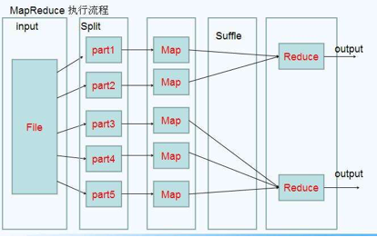
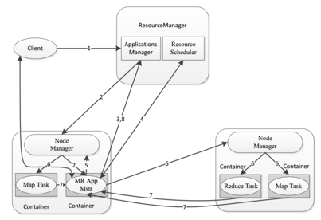
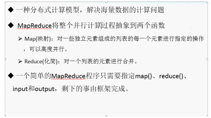
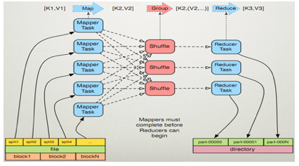
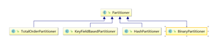

# Hadoop-Mapreduce

## 1. MapReduce 介绍

MapReduce思想在生活中处处可见。或多或少都曾接触过这种思想。MapReduce的思想核心是“分而治之”，适用于大量复杂的任务处理场景（大规模数据处理场景）。

* Map负责“分”，即把复杂的任务分解为若干个“简单的任务”来并行处理。可以进行拆分的前提是这些小任务可以并行计算，彼此间几乎没有依赖关系。
* Reduce负责“合”，即对map阶段的结果进行全局汇总。
* MapReduce运行在yarn集群
  1. ResourceManager
  2. NodeManager

这两个阶段合起来正是MapReduce思想的体现。



还有一个比较形象的语言解释MapReduce:

我们要数图书馆中的所有书。你数1号书架，我数2号书架。这就是“Map”。我们人越多，数书就更快。

现在我们到一起，把所有人的统计数加在一起。这就是“Reduce”。


### 1.1. MapReduce 设计构思

MapReduce是一个分布式运算程序的编程框架，核心功能是将用户编写的业务逻辑代码和自带默认组件整合成一个完整的分布式运算程序，并发运行在Hadoop集群上。

MapReduce设计并提供了统一的计算框架，为程序员隐藏了绝大多数系统层面的处理细节。为程序员提供一个抽象和高层的编程接口和框架。程序员仅需要关心其应用层的具体计算问题，仅需编写少量的处理应用本身计算问题的程序代码。如何具体完成这个并行计算任务所相关的诸多系统层细节被隐藏起来,交给计算框架去处理：

Map和Reduce为程序员提供了一个清晰的操作接口抽象描述。MapReduce中定义了如下的Map和Reduce两个抽象的编程接口，由用户去编程实现.Map和Reduce,MapReduce处理的数据类型是<key,value>键值对。

* Map: `(k1; v1) → [(k2; v2)]`

* Reduce: `(k2; [v2]) → [(k3; v3)]`

  

一个完整的mapreduce程序在分布式运行时有三类实例进程：
1. `MRAppMaster` 负责整个程序的过程调度及状态协调
2. `MapTask` 负责map阶段的整个数据处理流程
3. `ReduceTask` 负责reduce阶段的整个数据处理流程

   	

   	

	

## 2. MapReduce 编程规范
> MapReduce 的开发一共有八个步骤, 其中 Map 阶段分为 2 个步骤，Shuffle 阶段 4 个步骤，Reduce 阶段分为 2 个步骤

#####  Map 阶段 2 个步骤

1. 设置 InputFormat 类, 将数据切分为 Key-Value**(K1和V1)** 对, 输入到第二步
2. 自定义 Map 逻辑, 将第一步的结果转换成另外的 Key-Value（**K2和V2**） 对, 输出结果

##### Shuffle 阶段 4 个步骤

3. 对输出的 Key-Value 对进行**分区**
4. 对不同分区的数据按照相同的 Key **排序**
5. (可选) 对分组过的数据初步**规约**, 降低数据的网络拷贝
6. 对数据进行**分组**, 相同 Key 的 Value 放入一个集合中

##### Reduce 阶段 2 个步骤

7. 对多个 Map 任务的结果进行排序以及合并, 编写 Reduce 函数实现自己的逻辑, 对输入的 Key-Value 进行处理, 转为新的 Key-Value（**K3和V3**）输出
8. 设置 OutputFormat 处理并保存 Reduce 输出的 Key-Value 数据

## 3. WordCount

> 需求: 在一堆给定的文本文件中统计输出每一个单词出现的总次数

##### Step 1. 数据格式准备

1. 创建一个新的文件
  ```shell
  cd /export/servers
  vim wordcount.txt
  ```
2. 向其中放入以下内容并保存
  ```text
  hello,world,hadoop
  hive,sqoop,flume,hello
  kitty,tom,jerry,world
  hadoop
  ```
3. 上传到 HDFS
  ```shell
  hdfs dfs -mkdir /wordcount/
  hdfs dfs -put wordcount.txt /wordcount/
  ```

##### Step 2. Mapper

```java
public class WordCountMapper extends Mapper<LongWritable,Text,Text,LongWritable> {
    @Override
    public void map(LongWritable key, Text value, Context context) throws IOException, InterruptedException {
        String line = value.toString();
        String[] split = line.split(",");
        for (String word : split) {
            context.write(new Text(word),new LongWritable(1));
        }

    }
}
```

##### Step 3. Reducer

```java
public class WordCountReducer extends Reducer<Text,LongWritable,Text,LongWritable> {
    /**
     * 自定义我们的reduce逻辑
     * 所有的key都是我们的单词，所有的values都是我们单词出现的次数
     * @param key
     * @param values
     * @param context
     * @throws IOException
     * @throws InterruptedException
     */
    @Override
    protected void reduce(Text key, Iterable<LongWritable> values, Context context) throws IOException, InterruptedException {
        long count = 0;
        for (LongWritable value : values) {
            count += value.get();
        }
        context.write(key,new LongWritable(count));
    }
}
```

##### Step 4. 定义主类, 描述 Job 并提交 Job

```java
public class JobMain extends Configured implements Tool {
    @Override
    public int run(String[] args) throws Exception {
        Job job = Job.getInstance(super.getConf(), JobMain.class.getSimpleName());
        //打包到集群上面运行时候，必须要添加以下配置，指定程序的main函数
        job.setJarByClass(JobMain.class);
        //第一步：读取输入文件解析成key，value对
        job.setInputFormatClass(TextInputFormat.class);
        TextInputFormat.addInputPath(job,new Path("hdfs://192.168.52.250:8020/wordcount"));

        //第二步：设置我们的mapper类
        job.setMapperClass(WordCountMapper.class);
        //设置我们map阶段完成之后的输出类型
        job.setMapOutputKeyClass(Text.class);
        job.setMapOutputValueClass(LongWritable.class);
        //第三步，第四步，第五步，第六步，省略
        //第七步：设置我们的reduce类
        job.setReducerClass(WordCountReducer.class);
        //设置我们reduce阶段完成之后的输出类型
        job.setOutputKeyClass(Text.class);
        job.setOutputValueClass(LongWritable.class);
        //第八步：设置输出类以及输出路径
        job.setOutputFormatClass(TextOutputFormat.class);
        TextOutputFormat.setOutputPath(job,new Path("hdfs://192.168.52.250:8020/wordcount_out"));
        boolean b = job.waitForCompletion(true);
        return b?0:1;
    }

    /**
     * 程序main函数的入口类
     * @param args
     * @throws Exception
     */
    public static void main(String[] args) throws Exception {
        Configuration configuration = new Configuration();
        Tool tool  =  new JobMain();
        int run = ToolRunner.run(configuration, tool, args);
        System.exit(run);
    }
}
```

##### 常见错误

如果遇到如下错误

```text
Caused by: org.apache.hadoop.ipc.RemoteException(org.apache.hadoop.security.AccessControlException): Permission denied: user=admin, access=WRITE, inode="/":root:supergroup:drwxr-xr-x
```

直接将hdfs-site.xml当中的权限关闭即可

```xml
<property>
  <name>dfs.permissions</name>
  <value>false</value>
</property>
```

最后重启一下 HDFS 集群

##### 小细节

本地运行完成之后，就可以打成jar包放到服务器上面去运行了，实际工作当中，都是将代码打成jar包，开发main方法作为程序的入口，然后放到集群上面去运行

## 4. MapReduce 运行模式

##### 本地运行模式

1. MapReduce 程序是被提交给 LocalJobRunner 在本地以单进程的形式运行
2. 处理的数据及输出结果可以在本地文件系统, 也可以在hdfs上
3. 怎样实现本地运行? 写一个程序, 不要带集群的配置文件, 本质是程序的 `conf` 中是否有 `mapreduce.framework.name=local` 以及 `yarn.resourcemanager.hostname=local` 参数
4. 本地模式非常便于进行业务逻辑的 `Debug`, 只要在 `Eclipse` 中打断点即可

```java
configuration.set("mapreduce.framework.name","local");
configuration.set(" yarn.resourcemanager.hostname","local");
TextInputFormat.addInputPath(job,new Path("file:///F:\\传智播客大数据离线阶段课程资料\\3、大数据离线第三天\\wordcount\\input"));
TextOutputFormat.setOutputPath(job,new Path("file:///F:\\传智播客大数据离线阶段课程资料\\3、大数据离线第三天\\wordcount\\output"));
```

##### 集群运行模式

1. 将 MapReduce 程序提交给 Yarn 集群, 分发到很多的节点上并发执行
2. 处理的数据和输出结果应该位于 HDFS 文件系统
3. 提交集群的实现步骤: 将程序打成JAR包，然后在集群的任意一个节点上用hadoop命令启动

```shell
hadoop jar hadoop_hdfs_operate-1.0-SNAPSHOT.jar cn.itcast.hdfs.demo1.JobMain
```

## 5. MapReduce 分区

在 MapReduce 中, 通过我们指定分区, 会将同一个分区的数据发送到同一个 Reduce 当中进行处理

例如: 为了数据的统计, 可以把一批类似的数据发送到同一个 Reduce 当中, 在同一个 Reduce 当中统计相同类型的数据, 就可以实现类似的数据分区和统计等

其实就是相同类型的数据, 有共性的数据, 送到一起去处理

Reduce 当中默认的分区只有一个

	

> Step 1. 定义 Mapper

这个 Mapper 程序不做任何逻辑, 也不对 Key-Value 做任何改变, 只是接收数据, 然后往下发送

```java
public class MyMapper extends Mapper<LongWritable,Text,Text,NullWritable>{
    @Override
    protected void map(LongWritable key, Text value, Context context) throws IOException, InterruptedException {
        context.write(value,NullWritable.get());
    }
}
```

##### Step 2. 定义 Reducer 逻辑

这个 Reducer 也不做任何处理, 将数据原封不动的输出即可

```java
public class MyReducer extends Reducer<Text,NullWritable,Text,NullWritable> {
    @Override
    protected void reduce(Text key, Iterable<NullWritable> values, Context context) throws IOException, InterruptedException {
        context.write(key,NullWritable.get());
    }
}
```

##### Step 3. 自定义 Partitioner

主要的逻辑就在这里, 这也是这个案例的意义, 通过 Partitioner 将数据分发给不同的 Reducer

```java
public class PartitonerOwn extends Partitioner<Text,LongWritable> {
    @Override
    public int getPartition(Text text, LongWritable longWritable, int i) {
        if(text.toString().length() >=5 ){
            return  0;
        }else{
            return 1;
        }
    }
}
```

##### Step 4. Main 入口

```java
public class PartitionMain  extends Configured implements Tool {
    public static void main(String[] args) throws  Exception{
        int run = ToolRunner.run(new Configuration(), new PartitionMain(), args);
        System.exit(run);
    }
    @Override
    public int run(String[] args) throws Exception {
        Job job = Job.getInstance(super.getConf(), PartitionMain.class.getSimpleName());
        job.setJarByClass(PartitionMain.class);
        job.setInputFormatClass(TextInputFormat.class);
        job.setOutputFormatClass(TextOutputFormat.class);
        TextInputFormat.addInputPath(job,new Path("hdfs://192.168.52.250:8020/partitioner"));
        TextOutputFormat.setOutputPath(job,new Path("hdfs://192.168.52.250:8020/outpartition"));
        job.setMapperClass(MyMapper.class);
        job.setMapOutputKeyClass(Text.class);
        job.setMapOutputValueClass(NullWritable.class);
        job.setOutputKeyClass(Text.class);
        job.setMapOutputValueClass(NullWritable.class);
        job.setReducerClass(MyReducer.class);
        /**
         * 设置我们的分区类，以及我们的reducetask的个数，注意reduceTask的个数一定要与我们的
         * 分区数保持一致
         */
        job.setPartitionerClass(MyPartitioner.class);
        job.setNumReduceTasks(2);
        boolean b = job.waitForCompletion(true);
        return b?0:1;
    }
}
```

## 6. MapReduce 排序和序列化

* 序列化 (Serialization) 是指把结构化对象转化为字节流

* 反序列化 (Deserialization) 是序列化的逆过程. 把字节流转为结构化对象. 当要在进程间传递对象或持久化对象的时候, 就需要序列化对象成字节流, 反之当要将接收到或从磁盘读取的字节流转换为对象, 就要进行反序列化

* Java 的序列化 (Serializable) 是一个重量级序列化框架, 一个对象被序列化后, 会附带很多额外的信息 (各种校验信息, header, 继承体系等）, 不便于在网络中高效传输. 所以, Hadoop 自己开发了一套序列化机制(Writable), 精简高效. 不用像 Java 对象类一样传输多层的父子关系, 需要哪个属性就传输哪个属性值, 大大的减少网络传输的开销

* Writable 是 Hadoop 的序列化格式, Hadoop 定义了这样一个 Writable 接口. 一个类要支持可序列化只需实现这个接口即可

* 另外 Writable 有一个子接口是 WritableComparable, WritableComparable 是既可实现序列化, 也可以对key进行比较, 我们这里可以通过自定义 Key 实现 WritableComparable 来实现我们的排序功能

数据格式如下

```text
a	1
a	9
b	3
a	7
b	8
b	10
a	5
```

要求:
* 第一列按照字典顺序进行排列
* 第一列相同的时候, 第二列按照升序进行排列

解决思路:
* 将 Map 端输出的 `<key,value>` 中的 key 和 value 组合成一个新的 key (newKey), value值不变
* 这里就变成 `<(key,value),value>`, 在针对 newKey 排序的时候, 如果 key 相同, 就再对value进行排序

##### Step 1. 自定义类型和比较器

```java
public class PairWritable implements WritableComparable<PairWritable> {
    // 组合key,第一部分是我们第一列，第二部分是我们第二列
    private String first;
    private int second;
    public PairWritable() {
    }
    public PairWritable(String first, int second) {
        this.set(first, second);
    }
    /**
     * 方便设置字段
     */
    public void set(String first, int second) {
        this.first = first;
        this.second = second;
    }
    /**
     * 反序列化
     */
    @Override
    public void readFields(DataInput input) throws IOException {
        this.first = input.readUTF();
        this.second = input.readInt();
    }
    /**
     * 序列化
     */
    @Override
    public void write(DataOutput output) throws IOException {
        output.writeUTF(first);
        output.writeInt(second);
    }
    /*
     * 重写比较器
     */
    public int compareTo(PairWritable o) {
        //每次比较都是调用该方法的对象与传递的参数进行比较，说白了就是第一行与第二行比较完了之后的结果与第三行比较，
        //得出来的结果再去与第四行比较，依次类推
        System.out.println(o.toString());
        System.out.println(this.toString());
        int comp = this.first.compareTo(o.first);
        if (comp != 0) {
            return comp;
        } else { // 若第一个字段相等，则比较第二个字段
            return Integer.valueOf(this.second).compareTo(
                    Integer.valueOf(o.getSecond()));
        }
    }

    public int getSecond() {
        return second;
    }

    public void setSecond(int second) {
        this.second = second;
    }
    public String getFirst() {
        return first;
    }
    public void setFirst(String first) {
        this.first = first;
    }
    @Override
    public String toString() {
        return "PairWritable{" +
                "first='" + first + '\'' +
                ", second=" + second +
                '}';
    }
}
```

##### Step 2. Mapper

```java
public class SortMapper extends Mapper<LongWritable,Text,PairWritable,IntWritable> {

    private PairWritable mapOutKey = new PairWritable();
    private IntWritable mapOutValue = new IntWritable();

    @Override
    public  void map(LongWritable key, Text value, Context context) throws IOException, InterruptedException {
        String lineValue = value.toString();
        String[] strs = lineValue.split("\t");
        //设置组合key和value ==> <(key,value),value>
        mapOutKey.set(strs[0], Integer.valueOf(strs[1]));
        mapOutValue.set(Integer.valueOf(strs[1]));
        context.write(mapOutKey, mapOutValue);
    }
}
```

##### Step 3. Reducer

```java
public class SortReducer extends Reducer<PairWritable,IntWritable,Text,IntWritable> {

    private Text outPutKey = new Text();
    @Override
    public void reduce(PairWritable key, Iterable<IntWritable> values, Context context) throws IOException, InterruptedException {
//迭代输出
        for(IntWritable value : values) {
            outPutKey.set(key.getFirst());
            context.write(outPutKey, value);
        }
    }
}
```

##### Step 4. Main 入口

```java
public class SecondarySort  extends Configured implements Tool {
    @Override
    public int run(String[] args) throws Exception {
        Configuration conf = super.getConf();
        conf.set("mapreduce.framework.name","local");
        Job job = Job.getInstance(conf, SecondarySort.class.getSimpleName());
        job.setJarByClass(SecondarySort.class);

        job.setInputFormatClass(TextInputFormat.class);
        TextInputFormat.addInputPath(job,new Path("file:///L:\\大数据离线阶段备课教案以及资料文档——by老王\\4、大数据离线第四天\\排序\\input"));
        TextOutputFormat.setOutputPath(job,new Path("file:///L:\\大数据离线阶段备课教案以及资料文档——by老王\\4、大数据离线第四天\\排序\\output"));
        job.setMapperClass(SortMapper.class);
        job.setMapOutputKeyClass(PairWritable.class);
        job.setMapOutputValueClass(IntWritable.class);
        job.setReducerClass(SortReducer.class);
        job.setOutputKeyClass(Text.class);
        job.setOutputValueClass(IntWritable.class);
        boolean b = job.waitForCompletion(true);
        return b?0:1;
    }


    public static void main(String[] args) throws Exception {
        Configuration entries = new Configuration();
        ToolRunner.run(entries,new SecondarySort(),args);
    }
}
```
