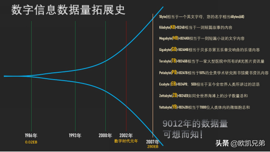

## yarn资源调度

### 1.**yarn**的介绍：

​	yarn是hadoop集群当中的资源管理系统模块，从hadoop2.0开始引入yarn模块,yarn可为各类计算框架提供资源的管理和调度,主要用于管理集群当中的资源（主要是服务器的各种硬件资源，包括CPU，内存，磁盘，网络IO等）以及调度运行在yarn上面的各种任务。

  	 yarn核心出发点是为了分离资源管理与作业监控，实现分离的做法是拥有一个全局的资源管理（ResourceManager，RM），以及每个应用程序对应一个的应用管理器（ApplicationMaster，AM） 

​	总结一句话就是说：yarn主要就是为了调度资源，管理任务等

其调度分为两个层级来说：

+ 一级调度管理：

  ​	计算资源管理(CPU,内存，网络IO，磁盘)

+ 二级调度管理：

  ​	任务内部的计算模型管理  (AppMaster的任务精细化管理)

**yarn的官网文档说明：**

<http://hadoop.apache.org/docs/r2.7.5/hadoop-yarn/hadoop-yarn-site/YARN.html>

**yarn集群的监控管理界面：**

<http://node01:8088/cluster>

**jobHistoryServer查看界面：**

<http://node01:19888/jobhistory>

 

### 2.**Yarn的**主要组件介绍与作用

  `YARN总体上是Master/Slave结构`，主要由ResourceManager、NodeManager、 ApplicationMaster和Container等几个组件构成。

- **ResourceManager(RM)** 
   负责处理客户端请求,对各NM上的资源进行统一管理和调度。给ApplicationMaster分配空闲的Container 运行并监控其运行状态。主要由两个组件构成：调度器和应用程序管理器：
  1. **调度器(Scheduler)**：调度器根据容量、队列等限制条件，将系统中的资源分配给各个正在运行的应用程序。调度器仅根据各个应用程序的资源需求进行资源分配，而资源分配单位是Container。Shceduler不负责监控或者跟踪应用程序的状态。总之，调度器根据应用程序的资源要求，以及集群机器的资源情况，为应用程序分配封装在Container中的资源。 
  2. **应用程序管理器(Applications Manager)**：应用程序管理器负责管理整个系统中所有应用程序，包括应用程序提交、与调度器协商资源以启动ApplicationMaster 、监控ApplicationMaster运行状态并在失败时重新启动等，跟踪分给的Container的进度、状态也是其职责。
- **NodeManager (NM)** 
    NodeManager 是每个节点上的资源和任务管理器。它会定时地向ResourceManager汇报本节点上的资源使用情况和各个Container的运行状态；同时会接收并处理来自ApplicationMaster 的Container 启动/停止等请求。
- **ApplicationMaster (AM)**： 
  用户提交的应用程序均包含一个**ApplicationMaster **，负责应用的监控，跟踪应用执行状态，重启失败任务等。ApplicationMaster是应用框架，它负责向ResourceManager协调资源，并且与NodeManager协同工作完成Task的执行和监控。
- **Container**： 
  Container是YARN中的资源抽象，它封装了某个节点上的多维度资源，如内存、CPU、磁盘、网络等，当ApplicationMaster向ResourceManager申请资源时，ResourceManager为ApplicationMaster 返回的资源便是用Container 表示的。

### 3.**yarn**的架构和工作流程

 

 

### 4.yarn的调度器

yarn我们都知道主要是用于做资源调度，任务分配等功能的，那么在hadoop当中，究竟使用什么算法来进行任务调度就需要我们关注了，hadoop支持好几种任务的调度方式，不同的场景需要使用不同的任务调度器.

##### `第一种调度器：FIFO Scheduler（队列调度）`

把任务按提交的顺序排成一个队列，这是一个先进先出队列，在进行资源分配的时候，先给队列中最头上的任务进行分配资源，待最头上任务需求满足后再给下一个分配，以此类推。

FIFO Scheduler是最简单也是最容易理解的调度器，也不需要任何配置，但它并不适用于共享集群。大的任务可能会占用所有集群资源，这就导致其它任务被阻塞。

	 

 

##### `第二种调度器：Capacity Scheduler（容量调度器，apache版本默认使用的调度器）`

Capacity 调度器允许多个组织共享整个集群，每个组织可以获得集群的一部分计算能力。通过为每个组织分配专门的队列，然后再为每个队列分配一定的集群资源，这样整个集群就可以通过设置多个队列的方式给多个组织提供服务了。除此之外，队列内部又可以垂直划分，这样一个组织内部的多个成员就可以共享这个队列资源了，在一个队列内部，资源的调度是采用的是先进先出(FIFO)策略。

 

##### `第三种调度器：Fair Scheduler（公平调度器，CDH版本的hadoop默认使用的调度器）`

Fair调度器的设计目标是为所有的应用分配公平的资源（对公平的定义可以通过参数来设置）。公平调度在也可以在多个队列间工作。举个例子，假设有两个用户A和B，他们分别拥有一个队列。当A启动一个job而B没有任务时，A会获得全部集群资源；当B启动一个job后，A的job会继续运行，不过一会儿之后两个任务会各自获得一半的集群资源。如果此时B再启动第二个job并且其它job还在运行，则它将会和B的第一个job共享B这个队列的资源，也就是B的两个job会用于四分之一的集群资源，而A的job仍然用于集群一半的资源，结果就是资源最终在两个用户之间平等的共享

 

 

使用哪种调度器取决于yarn-site.xml当中的

`yarn.resourcemanager.scheduler.class`  这个属性的配置

 

### 5.**关于**yarn常用参数设置

#### 设置container分配**最小内存**

 yarn.scheduler.minimum-allocation-mb	  1024   给应用程序container分配的最小内存

#### 设置container分配**最大内存**

 yarn.scheduler.maximum-allocation-mb	  8192	给应用程序container分配的最大内存

#### 设置每个**container的**最小**虚拟内核个数**

yarn.scheduler.minimum-allocation-vcores	  1	  每个container默认给分配的最小的虚拟内核个数

#### 设置每个container的最大虚拟内核个数

  yarn.scheduler.maximum-allocation-vcores	  32  每个container可以分配的最大的虚拟内核的个数

#### 设置NodeManager可以分配的内存大小

yarn.nodemanager.resource.memory-mb   8192  nodemanager可以分配的最大内存大小，默认8192Mb

####定义每台机器的内存使用大小

 yarn.nodemanager.resource.memory-mb  8192

 #### 定义交换区空间可以使用的大小

 交换区空间就是讲一块硬盘拿出来做内存使用,这里指定的是nodemanager的2.1倍

yarn.nodemanager.vmem-pmem-ratio   2.1  